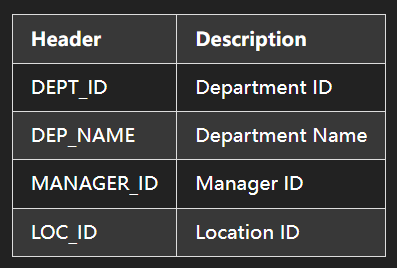
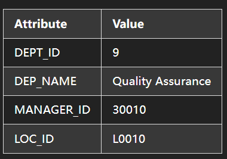

# Practice Problems

Try the following practice problems to test your understanding of the lab. Please note that the solutions for the following are not shared, and the learners are encouraged to use the discussion forums in case they need help.

## 1.

In the same database STAFF, create another table called Departments. The attributes of the table are as shown below.



## 2.

Populate the `Departments` table with the data available in the CSV file which can be downloaded from the link below using wget.

```
https://cf-courses-data.s3.us.cloud-object-storage.appdomain.cloud/IBMSkillsNetwork-PY0221EN-Coursera/labs/v2/Departments.csv
```

## 3. 

Append the Departments table with the following information.



## 4.

Run the following queries on the Departments Table:

a. View all entries

b. View only the department names

c. Count the total entries