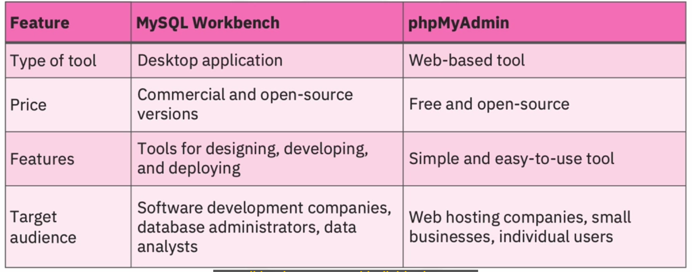

## 1. MySQL RDBMS

Là một cơ sở dữ liệu quan hệ mã nguồn mở, cho phép quản lý việc sáng tạo và tương tác với csdl, MariaDB là một nhánh của cơ sở dữ liệu MySQL bởi một số nhà phát triển ban đầu của MySQL.

MySQL có thể sử dụng thông qua việc tải xuống, và cũng có thể sử dụng trên nền tảng đám mây. Nền tảng đám mây cho phép tự quản lý trong máy ảo hay containers.

`IBM Cloud, Amazon RDS, Azure Database, Google Cloud SQL` cung cấp các tùy chọn tiện lợi để triển khai MySQL.

MySQL là lựa chọn phổ biến để lưu trữ và truy suất dữ liệu đa dạng môi trường tính toán. Sử dụng tốt cho doanh nghiệp nhỏ đến trung bình.

## 2. Popular MySQL Tools

- 2.1. MySQL command line interface.
- 2.2. mysqladmin command line program for RDBMS administration.
- 2.3. Specialized MySQL utilities fro specific tasks.
- 2.4. MySQL Workbench desktop application for: *windows, linux, macos*.
- 2.5. Third-party web interface, phpMyAdmin.



## 3. Create database and table

```SQL
CREATE DATABASE employees;
USE employees;
CREATE TABLE employee_details (firstname VARCHAR(20), lastname VARCHAR(20), startdate DATE, salary DECIMAL);
```

Dùng lệnh `DESCRIBE` để xem chi tiết về một table trong MySQL

```SQL
DESCRIBE employee_details;
```

## 4. Backup and Restore

**BACKUP**

```shell
mysqldump -u root employees > employeesbackup.sql
```

**RESTORE**

```shell
mysql -u root restored_employees < employeesbackup.sql
```

**RESTORE USING SOURCE**

```shell
mysql > source employeesbackup.sql
```

## 5. Loading Data

```SQL
INSERT INTO table_name(col1, col2, ..., col_n)
VALUES
    (val1, val2, ..., val_n),...
```

Có thể import file CSV bằng cách

```Shell
load data infile 'employeesdata.csv' into table employees_details
```

```shell
mysqlimport employees employees_details.csv
```


