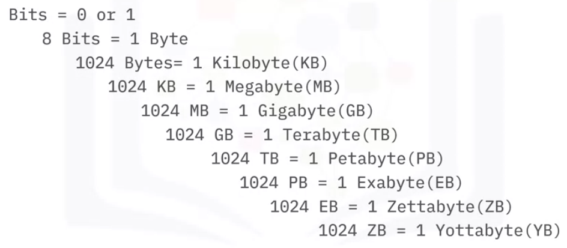
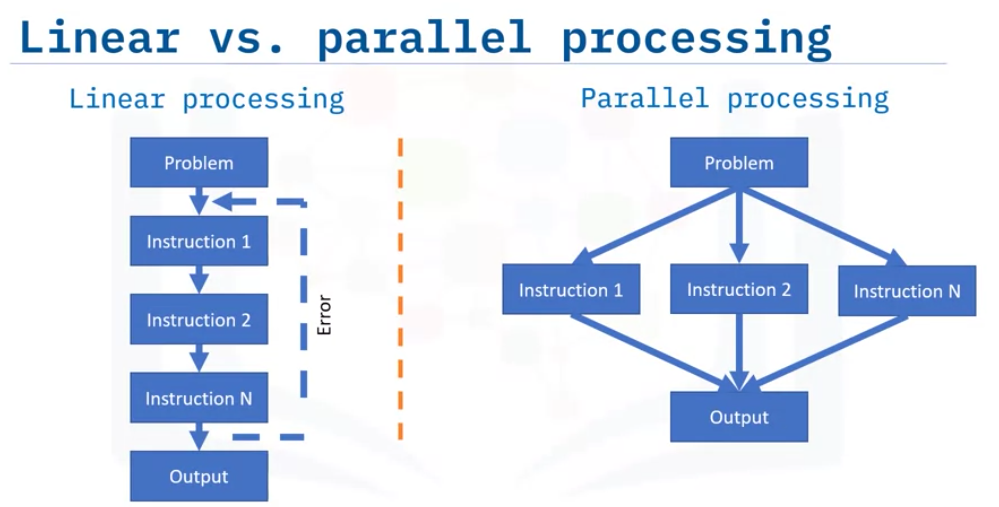
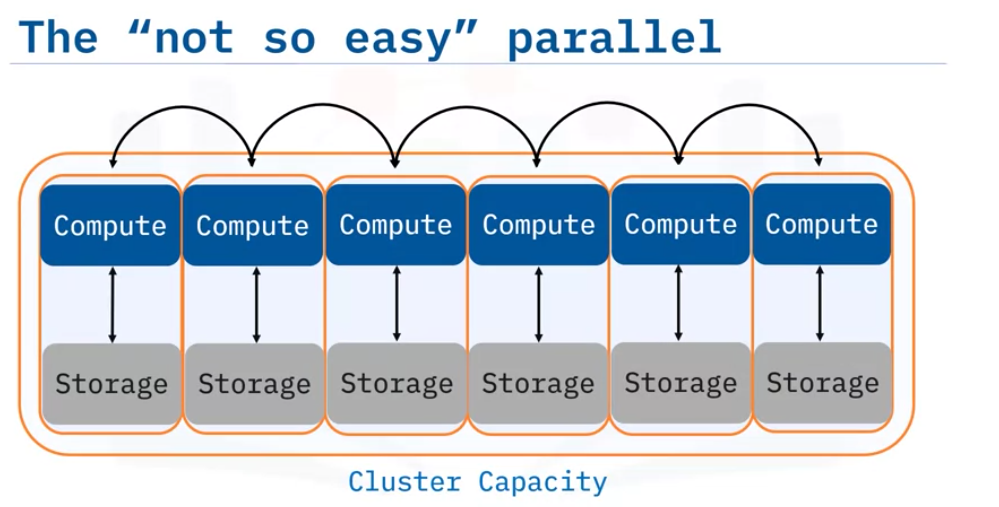

# 1. Big Data là gì?

## 1.1. Giới thiệu về Big Data

Big Data không chỉ đơn thuần là khối lượng dữ liệu lớn mà chúng ta đang tạo ra trong thời đại kỹ thuật số, mà nó còn bao gồm toàn bộ chu trình làm việc với dữ liệu lớn này. Theo Bernard Marr, chuyên gia về phân tích và dữ liệu lớn, Big Data là dấu vết số hóa mà chúng ta tạo ra thông qua các hoạt động hàng ngày.

Để hiểu rõ hơn về Big Data, chúng ta có thể so sánh nó với **Small Data**. Small Data là những dữ liệu nhỏ lẻ, có thể dễ dàng được hiểu và xử lý bởi con người mà không cần sự can thiệp quá nhiều từ các công cụ số hóa. Ví dụ về Small Data là điểm số thể thao hay lịch làm việc của nhân viên. Dữ liệu này được tích lũy chậm và có thể không được cập nhật liên tục, thường được lưu trữ dưới dạng cấu trúc như tên, địa chỉ, giới tính, và có thể được quản lý bởi các hệ thống cơ sở dữ liệu truyền thống.

Ngược lại, **Big Data** có khối lượng rất lớn, thường không có cấu trúc rõ ràng và được thu thập liên tục với tốc độ nhanh chóng. Ví dụ về dữ liệu bán cấu trúc là các bài đăng trên mạng xã hội đi kèm với hashtag, trong khi dữ liệu không cấu trúc có thể bao gồm hồ sơ y tế từ hàng triệu bệnh nhân. Vì độ phức tạp và khối lượng lớn, Big Data đòi hỏi các công cụ chuyên biệt như **Hadoop HDFS** hoặc **Apache Spark** để xử lý và lưu trữ.

## 1.2. Chu trình của Big Data

Quá trình xử lý Big Data bao gồm nhiều giai đoạn, từ thu thập, lưu trữ, mô hình hóa, xử lý, cho đến trực quan hóa dữ liệu. Hãy tưởng tượng quá trình này như sau:

- **Thu thập dữ liệu**: Bắt đầu khi doanh nghiệp gặp vấn đề hoặc yêu cầu cụ thể. Dữ liệu được thu thập và lưu trữ trong các framework lưu trữ phân tán như Hadoop HDFS.
- **Mô hình hóa dữ liệu**: Sau khi thu thập, dữ liệu được mô hình hóa bằng cách sử dụng các công cụ như MapReduce. Quá trình này giúp tạo ra cấu trúc cho dữ liệu và mối quan hệ giữa các thực thể dữ liệu.
- **Xử lý dữ liệu**: Các công cụ như Apache Spark giúp chuyển đổi dữ liệu thô thành thông tin có ý nghĩa để đưa ra quyết định.
- **Trực quan hóa dữ liệu**: Dữ liệu sau khi được xử lý được hiển thị dưới dạng biểu đồ, đồ thị để dễ dàng hiểu và sử dụng.

## 1.3. Đặc điểm của Big Data: 5 chữ "V"

- **Velocity (Tốc độ)**: Dữ liệu lớn được tạo ra với tốc độ rất nhanh. Để xử lý kịp thời, hệ thống phải có khả năng phân tích dữ liệu nhanh chóng, trong thời gian gần như thực.
  - Ví dụ: Một công ty thương mại điện tử có thể cần phân tích hàng triệu giao dịch mua bán trong thời gian thực để đưa ra các khuyến nghị sản phẩm ngay lập tức cho khách hàng.
  

- **Volume (Khối lượng)**: Big Data chứa đựng lượng dữ liệu khổng lồ, từ terabyte (TB) đến petabyte (PB), thậm chí là exabyte (EB).
  - Ví dụ: Hàng ngày, các nền tảng như Google, Facebook phải xử lý lượng dữ liệu khổng lồ từ người dùng trên toàn thế giới.

- **Variety (Sự đa dạng)**: Dữ liệu lớn không chỉ bao gồm dữ liệu có cấu trúc (như cơ sở dữ liệu truyền thống) mà còn có bán cấu trúc và không cấu trúc.
  - Ví dụ: Dữ liệu từ email, tin nhắn, video, hình ảnh đều thuộc dạng bán cấu trúc và không cấu trúc, đòi hỏi các công cụ chuyên biệt để phân tích.

- **Veracity (Độ tin cậy)**: Độ chính xác và tính toàn vẹn của dữ liệu rất quan trọng. Với khối lượng lớn dữ liệu, cần phải xác định liệu dữ liệu có đáng tin cậy hay không.
  - Ví dụ: Trong ngành y tế, dữ liệu không chính xác có thể dẫn đến những quyết định điều trị sai lầm.

- **Value (Giá trị)**: Giá trị của Big Data nằm ở khả năng chuyển đổi dữ liệu thô thành thông tin có thể hành động để đưa ra quyết định kinh doanh.
  - Ví dụ: Dữ liệu lớn có thể giúp doanh nghiệp phát hiện các xu hướng thị trường mới, cải thiện sản phẩm và dịch vụ.

## 1.4. Công cụ và hệ sinh thái của Big Data

Các công cụ phổ biến nhất để xử lý và phân tích Big Data bao gồm:

- **Hadoop HDFS**: Hệ thống lưu trữ phân tán, giúp lưu trữ khối lượng dữ liệu lớn trên các cụm máy chủ.

- **Apache Spark**: Công cụ xử lý dữ liệu mạnh mẽ, hỗ trợ xử lý dữ liệu theo lô và trong thời gian thực.
    - Ví dụ: Một doanh nghiệp có thể sử dụng Spark để phân tích dữ liệu bán hàng theo thời gian thực và điều chỉnh chiến lược marketing ngay lập tức.

## 1.5. Kết luận

Big Data là dấu vết kỹ thuật số mà chúng ta tạo ra trong thời đại số hóa, bao gồm nhiều dạng dữ liệu khác nhau, từ văn bản, hình ảnh, âm thanh đến video. Khái niệm Big Data xoay quanh 5 chữ "V" - Velocity, Volume, Variety, Veracity và Value - và yêu cầu các công cụ tiên tiến như Hadoop và Spark để xử lý và lưu trữ khối lượng dữ liệu lớn này. Big Data đã và đang giúp các tổ chức đưa ra quyết định kinh doanh thông minh hơn và khám phá các cơ hội thị trường mới.

# 2. Tác động của Big Data

## 2.1. Với người dùng

Một trong những ứng dụng phổ biến nhất của Big Data chính là hệ thống **đề xuất sản phẩm**. Hãy lấy ví dụ về Amazon: khi bạn tìm kiếm hoặc mua một sản phẩm trên nền tảng này, hệ thống sẽ đề xuất các sản phẩm liên quan dựa trên lịch sử tìm kiếm, giỏ hàng, các sản phẩm đã mua, và cả những sản phẩm mà người dùng khác đã xem hoặc mua.

Tương tự, các nền tảng như **Netflix** và **Spotify** cũng sử dụng các thuật toán Big Data để đề xuất nội dung (phim, nhạc) dựa trên sở thích và hành vi của người dùng trước đó. Các hệ thống đề xuất này không chỉ giúp nâng cao trải nghiệm người dùng mà còn thúc đẩy doanh thu cho doanh nghiệp.

**Trợ lý ảo** như Siri (Apple) hay Alexa (Amazon) cũng sử dụng Big Data để đưa ra các câu trả lời cho vô số câu hỏi từ người dùng. Những trợ lý này được hỗ trợ bởi các mạng nơ-ron nhân tạo tiên tiến để chuyển đổi giọng nói thành văn bản và từ đó thực hiện các nhiệm vụ phức tạp trên thiết bị. Ngoài dữ liệu cá nhân trên thiết bị, chúng còn truy xuất thông tin từ đám mây và các yếu tố bên ngoài.

Ví dụ, **Google Now** không chỉ trả lời câu hỏi mà còn có thể dự đoán nhu cầu của người dùng trước khi họ yêu cầu. Dựa trên thông tin từ lịch, vị trí và cảm biến của điện thoại, Google Now có thể cung cấp dự báo về giao thông, thời tiết, và thậm chí cả thông tin về các cuộc họp sắp tới, tất cả đều dựa trên phân tích Big Data.

## 2.2. Với doanh nghiệp

Big Data không chỉ thay đổi cách chúng ta tiêu thụ nội dung mà còn cách các doanh nghiệp hoạt động và cạnh tranh. Theo nhà phân tích dữ liệu Clive Humby, dữ liệu hiện nay có giá trị như "dầu mỏ" – một nguồn tài nguyên quý giá. Geoffrey Moore thậm chí còn so sánh dữ liệu với các giác quan của con người như thị giác và thính giác, cho thấy tầm quan trọng của việc nắm bắt thông tin từ Big Data.

Sự phát triển của các thuật toán máy học mạnh mẽ đã giúp các doanh nghiệp ra quyết định hiệu quả hơn, tối ưu hóa hoạt động và tăng cường khả năng cạnh tranh. Chính vì vậy, nhu cầu về các chuyên gia dữ liệu và kỹ sư Big Data đang ngày càng tăng, và kỹ năng làm việc với Big Data trở nên cực kỳ giá trị.

## 2.3. Internet of Things (IoT) và Big Data

**Internet of Things (IoT)** là một hệ thống các thiết bị vật lý kết nối với nhau qua Internet, từ các thiết bị thông minh trong nhà đến các thiết bị cá nhân như điện thoại hay máy tính. Những thiết bị này liên tục thu thập và truyền tải một lượng lớn dữ liệu mà không cần sự can thiệp của con người, nhờ vào các công nghệ nhúng.

**IoT và Big Data** có mối liên kết chặt chẽ. Các thiết bị IoT tạo ra khối lượng dữ liệu khổng lồ và chuyển chúng qua các hệ thống mạng để lưu trữ trên đám mây. Dữ liệu này sau đó được các kỹ sư dữ liệu xử lý và phân tích thông qua các thuật toán phức tạp để cung cấp các thông tin hữu ích.

Ví dụ: Một chiếc **camera an ninh** có thể liên tục tải lên các đoạn phim, sau đó một thuật toán dựa trên Big Data có thể phân tích và cảnh báo cho người dùng nếu có hoạt động khả nghi.

Dự báo của **Statista** cho thấy đến năm 2030, số lượng thiết bị IoT sẽ gấp bốn lần tổng số dân trên toàn thế giới, điều này chứng tỏ quy mô và tầm ảnh hưởng của IoT và Big Data sẽ còn phát triển mạnh mẽ trong tương lai.

## 2.4. Kết luận

- Big Data hiện diện khắp nơi và đang được thu thập để ra các quyết định kinh doanh và ảnh hưởng đến cuộc sống của con người.
- Các trợ lý ảo như Siri hay Alexa sử dụng Big Data để trả lời vô số câu hỏi và hỗ trợ người dùng trong các tác vụ hàng ngày.
- Google Now dựa trên Big Data để dự đoán nhu cầu và hành vi của người dùng.
- Các thiết bị IoT liên tục tạo ra dữ liệu khổng lồ, và Big Data giúp phân tích dữ liệu này để tối ưu hóa trải nghiệm khách hàng và hiệu suất kinh doanh.

**Ví dụ thực tế**: Một công ty bảo hiểm có thể sử dụng dữ liệu từ thiết bị IoT như cảm biến trong xe hơi để theo dõi thói quen lái xe của khách hàng. Dựa trên các dữ liệu này, công ty có thể cung cấp chính sách bảo hiểm cá nhân hóa, phù hợp với từng khách hàng, từ đó không chỉ tối ưu hóa chi phí mà còn tăng sự hài lòng của khách hàng.

# 3. Xử lý song song và khả năng mở rộng cho Big Data

## 3.1. Tại sao Big Data cần xử lý song song?

Big Data có khối lượng dữ liệu rất lớn, không thể xử lý trên một máy tính đơn lẻ. Để giải quyết bài toán này, cần phải chia dữ liệu và công việc thành nhiều phần nhỏ hơn, để các máy tính khác nhau có thể xử lý cùng lúc, từ đó rút ngắn thời gian xử lý. Đây chính là xử lý song song.

## 3.2. So sánh giữ xử lý tuyến tính và xử lý song song

**Xử lý tuyến tính (Linear Processing):** Là phương pháp truyền thống, trong đó các câu lệnh được thực thi theo tuần tự. Mỗi lệnh chỉ được thực hiện sau khi lệnh trước đó hoàn thành. Điều này phù hợp cho các tác vụ nhỏ, nhưng không hiệu quả với các bài toán lớn như Big Data, vì thời gian xử lý kéo dài và yêu cầu nhiều tài nguyên hệ thống.

- **Ví dụ:** Hãy tưởng tượng bạn cần xử lý một tập dữ liệu lớn trên một máy tính. Máy phải thực hiện từng bước một cho đến khi hoàn thành. Nếu gặp lỗi ở giữa quá trình, bạn phải bắt đầu lại từ đầu.

**Xử lý song song (Parallel Processing):** Ở đây, dữ liệu và công việc được chia thành nhiều phần và phân phối cho nhiều máy tính xử lý đồng thời. Nếu có lỗi xảy ra, chỉ cần xử lý lại phần bị lỗi mà không cần phải chạy lại toàn bộ quá trình.

- **Ví dụ:** Với một tập dữ liệu lớn, thay vì xử lý tuần tự trên một máy, bạn chia tập dữ liệu ra nhiều phần và phân bổ chúng cho nhiều máy khác nhau để xử lý cùng lúc.

## 3.3. Tại sao xử lý song song phù hợp Big Data

- **Rút ngắn thời gian xử lý:** Khi các tác vụ được phân chia và xử lý trên nhiều máy tính, thời gian xử lý giảm đáng kể so với xử lý tuyến tính.
- **Giảm yêu cầu về bộ nhớ và tài nguyên:** Các tác vụ được chia nhỏ và thực hiện trên nhiều máy khác nhau, mỗi máy chỉ cần một phần tài nguyên để xử lý dữ liệu.
- **Linh hoạt trong mở rộng hệ thống:** Có thể dễ dàng thêm hoặc bớt các máy tính (gọi là các nút) khi cần, giúp giảm chi phí hạ tầng.

**KHẢ NĂNG MỞ RỘNG VÀ ĐỘNG LỰC CHO MỞ RỘNG NGANG**

- Khi dữ liệu ngày càng lớn, bạn có thể nâng cấp máy tính bằng cách mở rộng dọc (Scaling Up), tức là tăng cường sức mạnh cho một máy tính đơn lẻ. Tuy nhiên, phương pháp này sẽ sớm gặp giới hạn khi dữ liệu vượt quá khả năng của máy tính, và chi phí để nâng cấp sẽ rất lớn.
- Mở rộng ngang (Horizontal Scaling): Thay vì nâng cấp một máy tính, bạn có thể thêm nhiều máy tính có năng lực tương tự để tạo thành một cụm máy tính (Cluster), giúp xử lý khối lượng dữ liệu lớn hơn.

- Ví dụ: Trong các cụm máy tính xử lý song song, nếu một tác vụ cần xử lý trên 1 TB dữ liệu, bạn có thể chia dữ liệu này ra thành các phần nhỏ và phân phối cho nhiều máy tính xử lý độc lập.

## 3.4. Tính toán “Embarrassingly Parallel” và tính chịu lỗi "Fault Tolerance"

**Embarrassingly Parallel** là các bài toán có thể dễ dàng được chia nhỏ và xử lý độc lập trên nhiều máy tính mà không cần sự phối hợp giữa chúng. Nếu một tác vụ gặp lỗi, nó không ảnh hưởng đến các tác vụ khác.
  - **Ví dụ thực tế:** Bạn cần thay đổi định dạng ngày tháng trong một tập dữ liệu lớn. Bạn có thể chia tập dữ liệu này thành nhiều phần nhỏ và xử lý trên các máy khác nhau. Nếu một phần gặp lỗi, chỉ cần xử lý lại phần đó mà không ảnh hưởng đến các phần còn lại.

Trong hệ thống xử lý dữ liệu lớn, các sự cố như hỏng phần cứng, mất kết nối có thể xảy ra. Hệ thống cần có khả năng chịu lỗi để tiếp tục hoạt động mà không bị gián đoạn. Điều này được thực hiện bằng cách lưu trữ bản sao dữ liệu trên nhiều máy khác nhau.

- **Ví dụ:** Giả sử bạn có ba phân vùng dữ liệu P1, P2, P3 trên một máy tính. Nếu máy này bị hỏng, các bản sao của các phân vùng này đã được lưu trữ trên các máy khác trong cụm. Bạn có thể thêm một máy mới và khôi phục dữ liệu từ các bản sao này.

## 3.5. Đưa tính toán đến dữ liệu

Trong hệ sinh thái Hadoop, khái niệm "đưa tính toán đến dữ liệu" là một ý tưởng cốt lõi. Thay vì di chuyển dữ liệu lớn giữa các nút, hệ thống sẽ thực hiện tính toán ngay tại vị trí mà dữ liệu đang được lưu trữ. Kết quả tính toán cũng sẽ được lưu ngay tại máy đó, giúp giảm thời gian và chi phí liên quan đến việc truyền dữ liệu.

