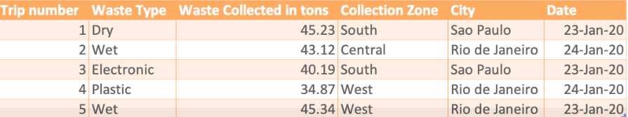

# 17. Final Project

## 17.1. Scenario

Bạn là kỹ sư dữ liệu được một công ty quản lý chất thải rắn thuê. Công ty thu gom và tái chế chất thải rắn trên khắp các thành phố lớn ở đất nước Brazil. Công ty vận hành hàng trăm xe tải các loại để thu gom, vận chuyển chất thải rắn. Công ty mong muốn tạo một kho dữ liệu để có thể tạo các báo cáo như:

- Tổng lượng rác thải được thu gom mỗi năm tại mỗi thành phố
- Tổng lượng rác thải được thu gom mỗi tháng tại mỗi thành phố
- Tổng lượng rác thải được thu gom mỗi quý tại mỗi thành phố
- Tổng lượng rác thải được thu gom mỗi năm trên mỗi loại xe tải
- Tổng lượng rác thải được thu gom theo loại xe tải ở mỗi thành phố
- Tổng lượng rác thải được thu gom theo loại xe tải/trạm/thành phố 

## 17.2. Tasks

- Task 1: Design the dimension table MyDimDate
- Task 2: Design the dimension table MyDimWaste 
- Task 3: Design the dimension table MyDimZone 

- Task 4: Design the fact table MyFactTrips

- Task 5: Create the dimension table MyDimDate

- Task 6: Create the dimension table MyDimWaste  

- Task 7: Create the dimension table MyDimZone 

- Task 8: Create the fact table MyFactTrips 

- Task 9: Load data into the dimension table DimDate 

- Task 10: Load data into the dimension table DimTruck 

- Task 11: Load data into the dimension table DimStation 

- Task 12: Load data into the fact table FactTrips 

- Task 13:  Create a grouping sets query

- Task 14: Create a rollup query 

- Task 15:  Create a cube query using the columns year, city, station, and average waste collected

- Task 16:  Create a materialized view named max_waste_per_station using the columns city, station, trucktype, and max waste collected 

## 17.3. Go to Project

Mẫu dữ liệu họ muốn thu thập:



Task 1:

|MyDimDate|
|---|
|dateid|
|month|
|day|
|year|
|monthname|
|weeknumday|
|nameweeknumday|
|quater|
|quatername|

Task 2:

|MyDimWaste|
|---|
|wasteid|
|wastetype|

Task 3:

|MyDimZone|
|---|
|zoneid|
|zonename|

Task 4:

|MyFactTrips|
|---|
|tripid|
|wastecollected|
|dateid|
|wasteid|
|zoneid|

Task 5:

```SQL
CREATE TABLE DimDate (
    dateid int not null primary key,
    date date,
    year int,
    quater int,
    quatername varchar(255),
    month int,
    monthname varchar(10), -- december is the max length
    day int,
    weeknumday int,
    nameweeknumday varchar(10)
);
```

Task 6:

```SQL
CREATE TABLE DimWaste (
    wasteid int not null primary key,
    wastename varchar(255)
);
```

Task 7:

```SQL
CREATE TABLE DimZone (
    zoneid int not null primary key,
    zonename varchar(255)
);
```

Task 8:

```SQL
CREATE TABLE FactWastes (
    tripid int not null primary key,
    wastecollected decimal(10, 2),
    dateid int,
    wasteid int,
    zoneid int,
    foreign key (dateid) references DimDate(dateid),
    foreign key (wasteid) references DimWaste(wasteid),
    foreign key (zoneid) references DimZone(zoneid)
);
```

Task 9:

Chỉ là thêm dữ liệu vào bảng, và có chút chỉnh sửa

Task 10:

|DimTruck|
|---|
|Truckid|
|TruckType|

```SQL
CREATE TABLE DimTruck (
    Truckid int not null primary key,
    TruckType varchar(255)
);
```

Task 11:

|DimStation|
|---|
|Stationid|
|City|

```SQL
CREATE TABLE DimStation (
    Stationid int not null primary key,
    City varchar(255)
);
```

Task 12: 

Cũng là tải dữ liệu vào

Task 13: Tạo một truy vấn nhóm bằng cách sử dụng các cột stationid, trucktype, total waste collected. 

```SQL
SELECT
    s.stationid, t.Trucktype, SUM(wastecollected) AS TotalWastes
FROM
    FactWastes f
INNER JOIN
    DimStation s ON f.Stationid = s.Stationid
INNER JOIN
    DimTruck t ON f.Truckid = t.Truckid
GROUP BY GROUPING SETS (
    (s.Stationid, t.Trucktype),
    s.Stationid,
    t.Trucktype,
    ()
)
ORDER BY
    s.Stationid, t.Trucktype;
```

Task 14: Tạo truy vấn ROLLUP bằng cách sử dụng các cột year, city, stationid, and total waste collected. 

```SQL
SELECT
    d.year, s.city, s.Stationid, SUM(wastecollected) AS TotalWaste
FROM
    FactWastes f
INNER JOIN
    DimDate d ON f.dateid = d.dateid
INNER JOIN
    DimStation s ON f.Stationid = s.Stationid
GROUP BY ROLLUP (d.year, s.city, s.Stationid)
ORDER BY
    d.year DESC, s.city, s.Stationid;
```

Task 15: Tạo truy vấn CUBE bằng cách sử dụng các cột year, city, stationid, and average waste collected. 

```SQL
SELECT
    d.year, s.city, s.Stationid, AVG(wastecollected) AS AverageWaste
FROM
    FactWastes f
INNER JOIN
    DimDate d ON f.dateid = d.dateid
INNER JOIN
    DimStation s ON f.Stationid = s.Stationid
GROUP BY CUBE (d.year, s.city, s.Stationid)
ORDER BY
    d.year DESC, s.city, s.Stationid;
```

Task 16: Tạo materialized view có tên `max_waste_stats` bằng cách sử dụng các cột city, stationid, trucktype, and max waste collected. 

```SQL
CREATE MATERIALIZED VIEW max_waste_stats AS
SELECT
    s.city, s.Stationid, t.trucktype, MAX(wastecollected) AS MaxWaste
FROM
    FactWastes f
INNER JOIN
    DimStation s ON f.Stationid = s.Stationid
INNER JOIN
    DimTruck t ON f.Truckid = t.Truckid
GROUP BY
    s.city, s.Stationid, t.trucktype
WITH DATA;
```


