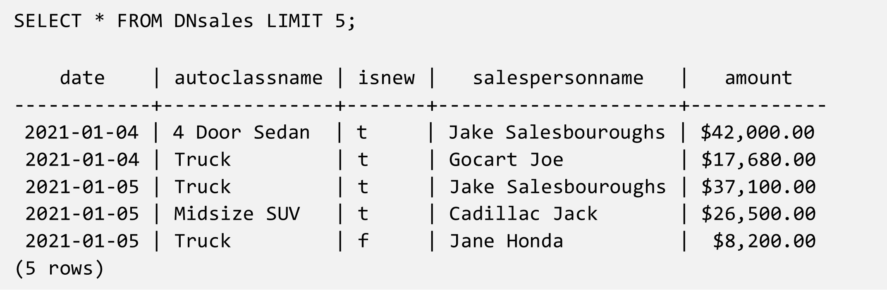

- [1. Data Warehouses](#1-data-warehouses)
  - [1.1. What is Data Warehouses](#11-what-is-data-warehouses)
  - [1.2. History and Development of Data Warehouse](#12-history-and-development-of-data-warehouse)
  - [1.3. Data Warehouses Use Cases](#13-data-warehouses-use-cases)
  - [1.4. Benefit of Using Data Warehouses](#14-benefit-of-using-data-warehouses)
  - [1.5. Population Data Warehouse Systems](#15-population-data-warehouse-systems)
    - [1.5.1. Data Warehouse Application](#151-data-warehouse-application)
    - [1.5.2. Data Warehouse Cloud](#152-data-warehouse-cloud)
    - [1.5.3. Data Warehouse supports both of Cloud and On-premesis](#153-data-warehouse-supports-both-of-cloud-and-on-premesis)
    - [1.5.4. Example](#154-example)
  - [1.6. Selecting Data Warehouse Systems](#16-selecting-data-warehouse-systems)
    - [1.6.1. Tính năng và khả năng của hệ thống Data Warehouse](#161-tính-năng-và-khả-năng-của-hệ-thống-data-warehouse)
    - [1.6.2. Khả năng triển khai và quản lý](#162-khả-năng-triển-khai-và-quản-lý)
    - [1.6.3. Độ dễ sử dụng và kỹ năng cần thiết](#163-độ-dễ-sử-dụng-và-kỹ-năng-cần-thiết)
    - [1.6.4. Chất lượng hỗ trợ](#164-chất-lượng-hỗ-trợ)
    - [1.6.5. Chi phí tổng thể (TCO - Total Cost of Ownership)](#165-chi-phí-tổng-thể-tco---total-cost-of-ownership)
    - [1.6.6. Example](#166-example)
- [2. Data Marts](#2-data-marts)
  - [2.1. What is Data Marts?](#21-what-is-data-marts)
  - [2.2. Purpose of Data Marts](#22-purpose-of-data-marts)
  - [2.3. Data Mart Category](#23-data-mart-category)
  - [2.4. Data Pipeline for Data Marts](#24-data-pipeline-for-data-marts)
- [3. IBM Db2 Data Warehouse](#3-ibm-db2-data-warehouse)
  - [3.1. What is IBM Data Warehouse?](#31-what-is-ibm-data-warehouse)
  - [3.2. Features](#32-features)
  - [3.3. Application of IBM Db2 Warehouse](#33-application-of-ibm-db2-warehouse)
  - [3.4. Support Tool and Library](#34-support-tool-and-library)
- [4. Data Lake](#4-data-lake)
  - [4.1. What is Data Lake?](#41-what-is-data-lake)
  - [4.2. Benefit ot Data Lake](#42-benefit-ot-data-lake)
  - [4.3. Data Lake Application](#43-data-lake-application)
  - [4.4. Difference of Data Lake and Data Warehouse](#44-difference-of-data-lake-and-data-warehouse)
- [5. Data Lake Explained](#5-data-lake-explained)
  - [5.1. Scenerio](#51-scenerio)
  - [5.2. Related with Data](#52-related-with-data)
  - [5.3. What is Data Lake?](#53-what-is-data-lake)
  - [5.4. What is Data Warehouse?](#54-what-is-data-warehouse)
  - [5.5. Challenge of Data Lake and Data Warehouse](#55-challenge-of-data-lake-and-data-warehouse)
  - [5.6. Data LakeHouse](#56-data-lakehouse)
- [6. Data Warehouse Architecture](#6-data-warehouse-architecture)
  - [6.1. Layers of Data Warehouse Architecture](#61-layers-of-data-warehouse-architecture)
  - [6.2. Security in Data Warehouse](#62-security-in-data-warehouse)
  - [6.3. Reference Architecture of IBM](#63-reference-architecture-of-ibm)
  - [6.4. Support Application from IBM](#64-support-application-from-ibm)
- [7. Cubes, Rollups, and Materialzed Views and Tables](#7-cubes-rollups-and-materialzed-views-and-tables)
  - [7.1. What is Data Cube?](#71-what-is-data-cube)
  - [7.2. Data Cube Operation](#72-data-cube-operation)
    - [7.2.1. Slicing](#721-slicing)
    - [7.2.2. Dicing](#722-dicing)
    - [7.2.3. Drilling Up or Down](#723-drilling-up-or-down)
    - [7.2.4. Pivoting](#724-pivoting)
    - [7.2.5. Rolling Up](#725-rolling-up)
  - [7.3. Materialized Views](#73-materialized-views)
    - [7.3.1. Creation Materialized View](#731-creation-materialized-view)
- [8. Grouping Sets in SQL](#8-grouping-sets-in-sql)
  - [8.1. SQL GROUP BY CLAUSE](#81-sql-group-by-clause)
  - [8.2. Examples](#82-examples)
    - [8.2.1. Example 1](#821-example-1)
    - [8.2.2. Example 2](#822-example-2)


# 1. Data Warehouses

## 1.1. What is Data Warehouses

Kho dữ liệu là một hệ thống tập hợp dữ liệu từ một hoặc nhiều nguồn vào một kho dữ liệu trung tâm, đồng nhất để hỗ trợ các yêu cầu phân tích dữ liệu khác nhau. Hãy cùng tìm hiểu sâu hơn về phân tích kho dữ liệu.

Hệ thống kho dữ liệu hỗ trợ khai thác dữ liệu, bao gồm ứng dụng trí tuệ nhân tạo (AI) và học máy (machine learning). Quá trình chuyển đổi dữ liệu trong quá trình ETL (Extract, Transform, Load) giúp tăng tốc độ báo cáo phía trước, cung cấp thông tin quan trọng nhanh chóng. Kho dữ liệu cho phép xử lý phân tích trực tuyến (OLAP), cung cấp phân tích dữ liệu đa chiều, linh hoạt và nhanh chóng cho các ứng dụng hỗ trợ quyết định và thông tin kinh doanh.

## 1.2. History and Development of Data Warehouse

Truyền thống, các kho dữ liệu được lưu trữ tại chỗ trong các trung tâm dữ liệu doanh nghiệp, ban đầu trên các máy chính và sau đó trên các hệ thống Unix, Windows và Linux. Các thiết bị kho dữ liệu xuất hiện với sự gia tăng khối lượng dữ liệu lớn vào những năm 2000. Những thiết bị này bao gồm một gói phần cứng chuyên biệt và phần mềm kho dữ liệu được tối ưu hóa, giúp giảm chi phí quản lý kho dữ liệu quy mô lớn.

Trong thập kỷ qua, với lượng dữ liệu khổng lồ được tạo ra và lưu trữ trên đám mây, các Kho Dữ Liệu Đám Mây (Cloud Data Warehouses - CDWs) đã trở nên phổ biến, nơi các tổ chức không mua phần cứng hoặc cài đặt phần mềm kho dữ liệu. Thay vào đó, các tổ chức truy cập kho dữ liệu như một dịch vụ có thể mở rộng, trả tiền theo mức sử dụng.

## 1.3. Data Warehouses Use Cases

**Thương Mại và E-commerce:** Các tổ chức thương mại và e-commerce sử dụng kho dữ liệu để phân tích và báo cáo hiệu suất bán hàng. Các tổ chức này cũng áp dụng mua sắm hỗ trợ bằng học máy, cung cấp cho người tiêu dùng các gợi ý phù hợp để thúc đẩy doanh số bán hàng thêm.

**Y Tế:** Bằng cách áp dụng trí tuệ nhân tạo vào dữ liệu bệnh nhân, các nhà cung cấp dịch vụ chăm sóc sức khỏe có thể truy cập các thông tin mới nhất và sử dụng thông tin đó để chẩn đoán và điều trị bệnh nhân với độ chính xác cao hơn.

**Giao Thông Vận Tải:** Các khả năng BI cho phép các nhà cung cấp giao thông vận tải tối ưu hóa lộ trình, thời gian di chuyển, nhu cầu thiết bị và yêu cầu nhân lực.

**Ngân Hàng và Fintech:** Các tổ chức fintech, bao gồm ngân hàng, áp dụng phân tích dữ liệu để đánh giá rủi ro, phát hiện gian lận và bán chéo dịch vụ.

**Mạng Xã Hội:** Các tổ chức mạng xã hội cần khả năng phân tích có thể đo lường nhanh chóng cảm xúc của khách hàng đang thay đổi và dự đoán doanh số sản phẩm.

**Chính Phủ:** Chính phủ áp dụng trí tuệ kinh doanh để phân tích và đánh giá các chương trình tập trung vào công dân và hỗ trợ các quyết định thay đổi chính sách.

## 1.4. Benefit of Using Data Warehouses

Kho dữ liệu cho phép các tổ chức tập trung dữ liệu từ các nguồn dữ liệu khác nhau, chẳng hạn như hệ thống giao dịch, cơ sở dữ liệu hoạt động và các tệp dữ liệu. Tích hợp dữ liệu, loại bỏ dữ liệu sai, loại bỏ trùng lặp và chuẩn hóa dữ liệu tạo ra một nguồn dữ liệu duy nhất, làm tăng chất lượng dữ liệu để phân tích. Một nguồn dữ liệu duy nhất cho phép người dùng tận dụng toàn bộ dữ liệu của công ty và truy cập dữ liệu đó hiệu quả hơn.

Ngoài ra, việc tách biệt các hoạt động cơ sở dữ liệu khỏi phân tích dữ liệu thường cải thiện hiệu suất truy cập dữ liệu, dẫn đến thông tin kinh doanh nhanh hơn. Các chức năng BI quy mô lớn như khai thác dữ liệu, trí tuệ nhân tạo và công cụ học máy hỗ trợ quyết định thông minh hơn bởi các chuyên gia dữ liệu và lãnh đạo doanh nghiệp. Những khả năng này xây dựng dựa trên nhau để cung cấp cho các tổ chức cơ hội và phương tiện để đạt được lợi thế cạnh tranh.

## 1.5. Population Data Warehouse Systems

Hầu hết các hệ thống Data Warehouse hiện nay được hỗ trợ thông qua ba nền tảng chính:

- **Thiết bị (appliance)**: Bao gồm phần cứng và phần mềm đã được tích hợp sẵn, cung cấp hiệu suất cao và giảm chi phí bảo trì.
- **Cloud**: Các nhà cung cấp chỉ hỗ trợ triển khai trên nền tảng đám mây, mang lại lợi ích về khả năng mở rộng và tính kinh tế dựa trên mô hình "pay-per-use" (trả theo nhu cầu).
- **On-premises**: Một số hệ thống Data Warehouse vẫn có thể được cài đặt tại môi trường nội bộ của tổ chức, nhưng hiện nay đa số nhà cung cấp cũng cung cấp cả giải pháp triển khai trên đám mây.

### 1.5.1. Data Warehouse Application

**Oracle Exadata**: Đây là hệ thống Data Warehouse được triển khai dưới dạng cài đặt nội bộ hoặc thông qua Oracle Public Cloud. Nó hỗ trợ nhiều loại tải công việc, bao gồm OLTP (xử lý giao dịch trực tuyến), phân tích dữ liệu, và phân tích dữ liệu trong bộ nhớ.

**IBM Netezza**: Có thể được triển khai trên IBM Cloud, Amazon Web Services, Microsoft Azure, hoặc các đám mây riêng tư. Netezza được biết đến với khả năng hỗ trợ khoa học dữ liệu và máy học.

### 1.5.2. Data Warehouse Cloud

- Amazon Redshift: Sử dụng phần cứng và phần mềm đặc thù của AWS để cung cấp tốc độ nén dữ liệu nhanh chóng, mã hóa, và tối ưu hóa thuật toán đồ thị. Nó tự động sắp xếp và lưu trữ dữ liệu theo cách tối ưu.

- Snowflake: Cung cấp giải pháp phân tích đa đám mây, tuân thủ các quy định bảo mật như GDPR và CCPA. Snowflake nổi bật với khả năng mã hóa liên tục cả khi dữ liệu đang di chuyển và khi lưu trữ.

- Google BigQuery: Được mô tả là giải pháp Data Warehouse "linh hoạt, đa đám mây", BigQuery cung cấp tốc độ truy vấn nhanh dưới một giây và khả năng phân tích thời gian thực với lượng dữ liệu khổng lồ (petabyte).

### 1.5.3. Data Warehouse supports both of Cloud and On-premesis

**Microsoft Azure Synapse Analytics**: Cung cấp quá trình ETL/ELT trực quan không cần mã với hơn 95 đầu nối gốc, hỗ trợ các trường hợp sử dụng cả Data Lake và Data Warehouse. Azure Synapse cũng hỗ trợ nhiều ngôn ngữ lập trình như T-SQL, Python, Scala, Spark SQL, và .NET.

**Teradata Vantage**: Kết hợp các công nghệ mã nguồn mở và thương mại để mang lại khả năng phân tích doanh nghiệp, hỗ trợ nhiều loại dữ liệu và nguồn dữ liệu mới. Teradata cung cấp các dịch vụ vận hành toàn diện như theo dõi, tối ưu hóa hiệu suất và quản lý bảo mật.

**IBM Db2 Warehouse**: Được biết đến với khả năng mở rộng, xử lý song song mạnh mẽ và tốc độ nhanh (petaflop), cũng như tính năng bảo mật và khả năng hoạt động ổn định với 99.99% thời gian hoạt động.

### 1.5.4. Example

**Ví dụ 1**: Amazon Redshift và Snowflake trong E-commerce Một doanh nghiệp thương mại điện tử lớn như Amazon có thể sử dụng Amazon Redshift để phân tích hành vi mua sắm của khách hàng từ hàng triệu giao dịch mỗi ngày. Đồng thời, Snowflake giúp các doanh nghiệp khác như Shopify thực hiện các phân tích đa đám mây, bảo mật dữ liệu khách hàng, và tuân thủ các quy định quốc tế.

**Ví dụ 2**: Google BigQuery trong phân tích thời gian thực Google BigQuery có thể giúp một công ty quảng cáo phân tích dữ liệu từ các chiến dịch quảng cáo hàng ngày. Với khả năng phân tích hàng petabyte dữ liệu chỉ trong vài giây, doanh nghiệp có thể điều chỉnh chiến dịch quảng cáo của mình theo thời gian thực để đạt hiệu quả tốt hơn.

## 1.6. Selecting Data Warehouse Systems

Khi lựa chọn hệ thống Data Warehouse, doanh nghiệp cần cân nhắc các tiêu chí chính sau đây:

- **Tính năng và khả năng**: Các tính năng liên quan đến vị trí, kiến trúc, khả năng mở rộng, loại dữ liệu hỗ trợ và khả năng phân tích dữ liệu.
- **Khả năng tương thích và triển khai**: Liệu hệ thống có hỗ trợ các quy trình quản lý, di chuyển, và chuyển đổi dữ liệu một cách dễ dàng hay không.
- **Độ dễ sử dụng và yêu cầu kỹ năng**: Nhân viên của tổ chức có đủ kỹ năng để triển khai và vận hành hệ thống không?
- **Chất lượng hỗ trợ**: Hỗ trợ từ nhà cung cấp có đủ đáp ứng yêu cầu về bảo mật, hiệu suất, và các kênh hỗ trợ không?
- **Chi phí tổng thể**: Bao gồm các chi phí hạ tầng, giấy phép phần mềm, di chuyển dữ liệu, quản lý và duy trì hệ thống.

### 1.6.1. Tính năng và khả năng của hệ thống Data Warehouse

**Vị trí**: Hệ thống có thể tồn tại dưới dạng on-premises, thiết bị chuyên dụng (appliance), hoặc trên một hay nhiều đám mây. Việc chọn vị trí phụ thuộc vào yêu cầu về bảo mật dữ liệu và tính riêng tư, ví dụ như tuân thủ CCPA hoặc GDPR.

**Kiến trúc và cấu trúc**: Doanh nghiệp cần xác định liệu họ sẵn sàng gắn kết với kiến trúc của một nhà cung cấp cụ thể hay không, hoặc liệu họ cần hệ thống đa đám mây. Khả năng mở rộng và hỗ trợ nhiều loại dữ liệu như dữ liệu bán cấu trúc và không cấu trúc cũng rất quan trọng.

**Khả năng hỗ trợ Big Data**: Hệ thống cần hỗ trợ cả dữ liệu theo lô (batch) và dữ liệu trực tuyến (streaming) nếu doanh nghiệp làm việc với dữ liệu lớn.

### 1.6.2. Khả năng triển khai và quản lý

**Quản trị dữ liệu**: Khả năng thực hiện quản trị dữ liệu hiệu quả là điều cần thiết. Hệ thống cũng cần có khả năng tối ưu hóa và điều chỉnh lại hiệu suất khi nhu cầu thay đổi.

**Quản lý người dùng**: Với xu hướng áp dụng chính sách "zero-trust", các tổ chức cần triển khai chương trình quản lý và xác thực người dùng để bảo vệ dữ liệu khỏi các rủi ro bảo mật.

### 1.6.3. Độ dễ sử dụng và kỹ năng cần thiết

**Kỹ năng nhân sự**: Doanh nghiệp cần đánh giá xem nhân viên của họ có đủ kỹ năng để triển khai và vận hành hệ thống mới không. Nếu không, liệu họ có thể nhanh chóng học hỏi các kỹ năng cần thiết hay không.

**Đối tác triển khai**: Đối tác triển khai có kinh nghiệm sẽ giúp đảm bảo quá trình tích hợp diễn ra thuận lợi, đặc biệt đối với các hệ thống lớn và phức tạp.

### 1.6.4. Chất lượng hỗ trợ

**Hỗ trợ từ nhà cung cấp**: Việc lựa chọn một nhà cung cấp duy nhất có thể giảm bớt thời gian và chi phí, vì họ có trách nhiệm toàn bộ với hệ thống. Tổ chức cần kiểm tra kỹ các điều khoản về dịch vụ, bao gồm thời gian hoạt động, bảo mật, và khả năng mở rộng.

**Kênh hỗ trợ**: Các kênh hỗ trợ phổ biến bao gồm điện thoại, email, chat, và tin nhắn. Ngoài ra, hệ thống có cung cấp các giải pháp tự phục vụ và cộng đồng người dùng phong phú hay không cũng là một yếu tố quan trọng.

### 1.6.5. Chi phí tổng thể (TCO - Total Cost of Ownership)

**Chi phí hạ tầng**: Bao gồm chi phí tính toán và lưu trữ, bất kể hệ thống được triển khai on-premises hay trên đám mây.

**Giấy phép phần mềm và chi phí sử dụng**: Đối với các giải pháp đám mây, chi phí có thể bao gồm đăng ký hoặc sử dụng dựa trên tài nguyên.

**Chi phí di chuyển dữ liệu**: Việc di chuyển dữ liệu vào hệ thống Data Warehouse mới có thể đòi hỏi chi phí cho việc tích hợp, cắt giảm dữ liệu thừa và quản lý dữ liệu.

**Chi phí quản trị**: Bao gồm chi phí nhân lực để quản lý và đào tạo nhân viên về hệ thống mới.

**Chi phí hỗ trợ và bảo trì**: Các khoản chi phí định kỳ để duy trì dịch vụ và hỗ trợ từ nhà cung cấp.

### 1.6.6. Example

**Ví dụ 1**: Chọn Data Warehouse dựa trên yêu cầu bảo mật Một tổ chức tài chính lớn có yêu cầu nghiêm ngặt về bảo mật và tuân thủ quy định. Do đó, họ quyết định triển khai hệ thống Data Warehouse on-premises để kiểm soát hoàn toàn dữ liệu và đáp ứng các quy định quốc gia về bảo mật như GDPR.

**Ví dụ 2**: Hệ thống Data Warehouse trên đám mây cho công ty khởi nghiệp Ngược lại, một công ty khởi nghiệp công nghệ với nguồn tài chính hạn chế có thể chọn giải pháp Data Warehouse đám mây như Amazon Redshift để tận dụng khả năng mở rộng linh hoạt và chỉ phải trả cho những tài nguyên họ sử dụng.

# 2. Data Marts

## 2.1. What is Data Marts?

Data mart là một `phần biệt lập của enterprise data warehouse (EDW)`, được thiết kế để `phục vụ một chức năng`, `mục đích cụ thể `hoặc một `nhóm người dùng trong doanh nghiệp`. Ví dụ, phòng kinh doanh và tài chính của công ty có thể có các data marts riêng để thu thập dữ liệu cần thiết cho các báo cáo doanh thu hàng quý. Tương tự, bộ phận marketing có thể sử dụng data marts để phân tích hành vi khách hàng, trong khi các bộ phận như vận chuyển, sản xuất hoặc bảo hành có thể có data marts riêng của họ.

**Ví dụ**: Một công ty sản xuất có thể có một data mart dành riêng cho phòng tài chính, nơi lưu trữ dữ liệu về chi phí, lợi nhuận và doanh thu. Data mart này giúp bộ phận tài chính có thể truy xuất nhanh chóng và dễ dàng các báo cáo liên quan đến tình hình kinh doanh của công ty mà không cần truy cập vào kho dữ liệu tổng thể lớn hơn.

## 2.2. Purpose of Data Marts

Mục đích chính của data marts là cung cấp dữ liệu tập trung và hỗ trợ đưa ra các quyết định chiến thuật. Data marts thường chỉ tập trung vào các dữ liệu liên quan nhất, giúp người dùng tiết kiệm thời gian tìm kiếm trong kho dữ liệu rộng lớn.

`Cấu trúc của data mart` thường là một `cơ sở dữ liệu quan hệ với sơ đồ dạng sao` (star schema) hoặc `bông tuyết` (snowflake schema). Trong đó:

- Bảng thực tế (fact table) lưu trữ các chỉ số kinh doanh quan trọng.
- Bảng chiều (dimension table) cung cấp ngữ cảnh cho các chỉ số đó, ví dụ như thời gian, khu vực địa lý, hoặc sản phẩm.

## 2.3. Data Mart Category

Có ba loại data mart chính, dựa trên mối quan hệ của chúng với data warehouse:

- **Data Mart Phụ thuộc (Dependent Data Mart)**: Lấy dữ liệu từ kho dữ liệu doanh nghiệp (EDW). Loại này thừa hưởng các quy tắc bảo mật và tính năng đã được thiết lập sẵn từ EDW.

- **Data Mart Độc lập (Independent Data Mart)**: Không phụ thuộc vào EDW mà trực tiếp lấy dữ liệu từ các hệ thống vận hành nội bộ hoặc từ các nguồn bên ngoài. Các data marts này cần pipeline ETL riêng để xử lý, chuyển đổi và tích hợp dữ liệu.

- **Data Mart Lai (Hybrid Data Mart)**: Kết hợp giữa data warehouse và các nguồn dữ liệu khác (nội bộ hoặc bên ngoài).

## 2.4. Data Pipeline for Data Marts

Để `tải dữ liệu vào một data mart`, các doanh nghiệp sử dụng quy trình `ETL (Extract, Transform, Load)`:

- Extract: Trích xuất dữ liệu từ các nguồn khác nhau.
- Transform: Chuyển đổi và làm sạch dữ liệu, loại bỏ thông tin không chính xác hoặc không phù hợp.
- Load: Tải dữ liệu đã làm sạch vào data mart để phục vụ các truy vấn phân tích.

**Ví dụ thực tế**: Một công ty bán lẻ có thể sử dụng ETL pipeline để trích xuất dữ liệu bán hàng từ các cửa hàng, làm sạch và tổ chức lại dữ liệu, sau đó tải dữ liệu vào data mart để phòng kinh doanh có thể phân tích xu hướng doanh số.

# 3. IBM Db2 Data Warehouse

## 3.1. What is IBM Data Warehouse?

**IBM Db2 Warehouse** là một giải pháp kho dữ liệu hoàn chỉnh, cung cấp mức độ kiểm soát cao đối với dữ liệu và ứng dụng của bạn. Nó hỗ trợ `triển khai dễ dàng trong môi trường container hóa như Docker` và cực kỳ linh hoạt cho các môi trường quản lý bởi khách hàng `(on-premises), đám mây (cloud), và môi trường lai (hybrid)`.

Db2 Warehouse sử dụng công nghệ `Massively Parallel Processing (MPP)` giúp tự động mở rộng quy mô và hỗ trợ các triển khai container. Điều này giúp các hệ thống có khả năng xử lý khối lượng lớn truy vấn phức tạp một cách nhanh chóng và hiệu quả.

Một điểm nổi bật của Db2 Warehouse là `tích hợp sẵn các thuật toán máy học` và khả năng phân tích nghiệp vụ trong cơ sở dữ liệu để tối ưu tốc độ.

## 3.2. Features

**Tự động tạo lược đồ dữ liệu**: Db2 Warehouse có khả năng tự động tạo lược đồ dữ liệu và chuyển đổi dữ liệu không có cấu trúc thành dạng có cấu trúc để dễ dàng phân tích.

**Tăng tốc truy vấn bằng BLU Acceleration**: Sử dụng các phương pháp tối ưu như xử lý SQL theo cột trong bộ nhớ (in-memory columnar processing) và data-skipping (bỏ qua dữ liệu không cần thiết), Db2 Warehouse đẩy nhanh quá trình truy vấn dữ liệu.

**Dashboard theo dõi hiệu suất**: Cung cấp các widget giám sát hiệu suất hệ thống, bao gồm các cảnh báo về phần cứng, phần mềm và lưu trữ. Người dùng có thể xem chi tiết về thời gian thực hiện truy vấn SQL, trạng thái chờ khóa, và nhiều thông tin khác liên quan đến sự kiện cảnh báo cơ sở dữ liệu.

## 3.3. Application of IBM Db2 Warehouse

Db2 Warehouse rất phù hợp với các trường hợp sau:

- **Tính linh hoạt và khả năng mở rộng**: Phù hợp với các hệ thống cần tính mở rộng cao.
- **Triển khai trên đám mây, tại chỗ (on-premises), hoặc hybrid**: Hỗ trợ đa dạng các môi trường triển khai.
- **Tích hợp các nguồn dữ liệu rời rạc**: Hợp nhất và tích hợp các nguồn dữ liệu khác nhau.
- **Phát triển nhanh các sản phẩm phân tích theo dòng nghiệp vụ**: Tạo các data marts một cách nhanh chóng.
- **Quản lý dữ liệu nhạy cảm hoặc có tính pháp lý**: Hỗ trợ lưu trữ và quản lý dữ liệu quan trọng, nhạy cảm.
- **Lưu trữ dữ liệu có cấu trúc lâu năm**: Phù hợp cho các dữ liệu SQL cũ, không thường xuyên sử dụng.

## 3.4. Support Tool and Library

Db2 Warehouse tích hợp với nhiều ngôn ngữ và công cụ phổ biến như:

- `JDBC, Node.JS, Spring, Python, R, Go, Spark, và Microsoft Visual Studio.`
- `Apache Spark`: Hỗ trợ phân vùng và triển khai trên nhiều máy chủ để mở rộng phân tích dữ liệu.

**Ví dụ thực tế**: Bạn có thể triển khai các job Apache Spark qua các stored procedures để chạy trên Db2 Warehouse, giúp mở rộng khả năng phân tích.

    R Studio: Hỗ trợ phân tích, xử lý, mô hình hóa và trực quan hóa dữ liệu với Db2 Warehouse. Ví dụ, bạn có thể tạo một Docker image chứa RStudio cùng các gói và driver cần thiết để kết nối với Db2 Warehouse. Thậm chí, bạn có thể phát triển ứng dụng chạy mã R tích hợp với Db2 thông qua REST API.


Db2 Warehouse cũng cung cấp nhiều driver mã nguồn mở phổ biến trên GitHub, như thư viện `python-ibmdb`, cho phép kết nối Python với IBM Db2.

# 4. Data Lake

## 4.1. What is Data Lake?

Data Lake là một kho lưu trữ dữ liệu có khả năng lưu trữ một lượng lớn dữ liệu thuộc nhiều loại khác nhau như:

- Dữ liệu có cấu trúc (structured data), ví dụ như các bảng dữ liệu từ cơ sở dữ liệu quan hệ.
- Dữ liệu bán cấu trúc (semi-structured data), chẳng hạn như các file JSON hoặc XML.
- Dữ liệu phi cấu trúc (unstructured data), bao gồm văn bản, email, hình ảnh và video.

Điểm quan trọng của Data Lake là `dữ liệu được lưu trữ trực tiếp từ nguồn gốc` mà `không cần phải qua quá trình xử lý hoặc định nghĩa trước` về cấu trúc hay lược đồ (schema).

**Ví dụ thực tế**: `Google Drive` hoặc `Amazon S3` có thể được xem như các dạng đơn giản của Data Lake, nơi bạn lưu trữ nhiều loại file khác nhau mà không cần phải sắp xếp hay phân loại chi tiết từ ban đầu.


## 4.2. Benefit ot Data Lake

Data Lake mang lại nhiều lợi ích quan trọng, đặc biệt là đối với các tổ chức có `khối lượng dữ liệu lớn` và `đa dạng`:

- **Lưu trữ linh hoạt**: Data Lake có thể lưu trữ mọi loại dữ liệu, từ có cấu trúc, bán cấu trúc đến phi cấu trúc, mà không cần phải chuyển đổi hay định nghĩa trước.
- **Khả năng mở rộng**: Bạn có thể mở rộng dung lượng lưu trữ từ terabyte đến petabyte dữ liệu mà không gặp khó khăn trong việc quản lý cấu trúc dữ liệu.
- **Tiết kiệm thời gian**: Không cần phải tạo lược đồ hay chuyển đổi dữ liệu trước khi tải vào Data Lake, giúp tiết kiệm thời gian và công sức cho tổ chức.
- **Tái sử dụng linh hoạt**: Dữ liệu được lưu trữ ở dạng thô, nguyên bản, do đó có thể dễ dàng sử dụng lại cho các mục đích phân tích khác nhau trong tương lai, bao gồm cả phân tích máy học và phân tích nâng cao.

## 4.3. Data Lake Application

Một trong những ứng dụng chính của Data Lake là làm `kho lưu trữ dữ liệu trung gian trước khi tải dữ liệu vào Data Warehouse hoặc Data Mart`. Bạn có thể lấy dữ liệu từ nhiều nguồn khác nhau, lưu trữ trong Data Lake, và sau đó chuyển đổi dữ liệu theo nhu cầu phân tích cụ thể.

**Ví dụ thực tế:** Trong một tổ chức lớn như Amazon, nơi có rất nhiều loại dữ liệu đến từ nhiều hệ thống khác nhau (giao dịch, thông tin khách hàng, logs hệ thống), họ sẽ dùng Data Lake để lưu trữ tất cả dữ liệu này dưới dạng thô. Sau đó, tùy vào các mục đích phân tích, dữ liệu mới được chuyển đổi và tải vào Data Warehouse để tạo các báo cáo cụ thể.

## 4.4. Difference of Data Lake and Data Warehouse

Data Lake và Data Warehouse có các điểm khác biệt cơ bản về cách lưu trữ và sử dụng dữ liệu:

- **Dữ liệu trong Data Lake**: `Được lưu trữ dưới dạng thô, chưa qua xử lý`. Dữ liệu này có thể chưa tuân theo bất kỳ quy chuẩn hay cấu trúc nào và chưa được kiểm duyệt.

- **Dữ liệu trong Data Warehouse**: `Đã được xử lý, chuẩn hóa và tuân thủ các tiêu chuẩn dữ liệu trước khi lưu trữ`. Điều này giúp việc truy vấn và phân tích dễ dàng hơn nhưng lại cần nhiều công đoạn chuẩn bị.

- **Cấu trúc dữ liệu (Schema)**: `Trong Data Lake, bạn không cần định nghĩa cấu trúc dữ liệu trước khi tải dữ liệu vào`. Điều này tạo sự linh hoạt khi lưu trữ các loại dữ liệu khác nhau.
    - Ngược lại, `Data Warehouse yêu cầu phải có cấu trúc và lược đồ dữ liệu rõ ràng trước khi dữ liệu được tải vào`.

- **Chất lượng dữ liệu**: Dữ liệu trong Data Lake có thể chưa được kiểm duyệt hoặc không tuân thủ quy trình quản lý dữ liệu (Data Governance). Trong khi đó, dữ liệu trong Data Warehouse luôn được kiểm tra, tuân thủ các quy chuẩn và đảm bảo chất lượng.

- **Người dùng**:
    - `Data Lake thường được sử dụng bởi các nhà khoa học dữ liệu` (Data Scientists), `nhà phát triển dữ liệu` (Data Developers), và `kỹ sư máy học` (Machine Learning Engineers) do tính linh hoạt và khả năng lưu trữ dữ liệu chưa qua xử lý của nó.
    - `Data Warehouse chủ yếu được dùng bởi các nhà phân tích kinh doanh` (Business Analysts) và `nhà phân tích dữ liệu `(Data Analysts) vì nó cung cấp dữ liệu đã qua xử lý, dễ dàng hơn cho việc tạo các báo cáo và phân tích trực tiếp.

# 5. Data Lake Explained

## 5.1. Scenerio

Trong một nhà bếp thương mại, có rất `nhiều khâu để biến nguyên liệu thô thành món ăn hoàn chỉnh`. Chúng ta có nguyên liệu được vận chuyển từ các nhà cung cấp và giao đến kho bãi của nhà hàng. `Các nguyên liệu được sắp xếp và bảo quản theo từng loại như kho khô cho thực phẩm khô hoặc tủ lạnh/tủ đông cho rau tươi và thịt`. Quy trình này `phải được tiến hành nhanh chóng để tránh lãng phí` và `đảm bảo an toàn thực phẩm`. `Nếu không` thực hiện đúng, các đầu bếp sẽ `mất nhiều thời gian tìm kiếm nguyên liệu` hơn là nấu nướng.

## 5.2. Related with Data

Bạn có thể đang tự hỏi: Điều này liên quan gì đến dữ liệu? Thực ra, quy trình tương tự này cũng tồn tại trong kiến trúc dữ liệu của các tổ chức. Hãy tưởng tượng rằng thay vì nguyên liệu thực phẩm, bạn có đủ loại dữ liệu đến từ nhiều nguồn khác nhau: từ các dịch vụ đám mây, ứng dụng hoạt động, đến dữ liệu từ mạng xã hội. Chúng ta luôn có dữ liệu mới liên tục được đưa vào tổ chức giống như việc nhà hàng luôn nhận nguyên liệu từ các nhà cung cấp.

Cũng giống như nhà hàng cần kho bãi để chứa nguyên liệu, trong thế giới dữ liệu, chúng ta cần nơi để chứa những dữ liệu thô này. Đó là lý do mà Data Lake (Hồ dữ liệu) xuất hiện.

## 5.3. What is Data Lake?

`Data Lake là một kho lưu trữ cho phép chúng ta thu thập nhanh chóng và ít tốn chi phí cả dữ liệu thô`, có thể là dữ liệu có cấu trúc, dữ liệu phi cấu trúc, và thậm chí là dữ liệu bán cấu trúc.

Tuy nhiên, `cũng giống như nhà hàng không nấu ăn ngay tại bến tải hàng`, chúng ta `không phân tích dữ liệu thô ngay tại Data Lake`. Dữ liệu `cần được tổ chức và chuyển đổi từ trạng thái thô thành một thứ có thể sử dụng được`. Đó là lúc chúng ta cần đến Enterprise Data Warehouse (EDW).

## 5.4. What is Data Warehouse?

`Data Warehouse là nơi dữ liệu được tối ưu hóa và tổ chức để phục vụ cho các nhiệm vụ phân tích cụ thể`. Dữ liệu có thể được chuyển từ Data Lake hoặc trực tiếp từ các nguồn dữ liệu khác vào Data Warehouse, sau đó được sử dụng cho các tác vụ như Business Intelligence (BI), xây dựng báo cáo và dashboard.

Dữ liệu trong Data Warehouse được làm sạch, tổ chức và quản lý chặt chẽ. `Nó giống như các kho lạnh trong nhà bếp`, nơi nguyên liệu được bảo quản kỹ lưỡng để luôn sẵn sàng cho đầu bếp sử dụng một cách an toàn và hiệu quả.

## 5.5. Challenge of Data Lake and Data Warehouse

Mặc dù `Data Lakes` cho phép lưu trữ dữ liệu lớn với chi phí thấp, nhưng nó có thể `gặp khó khăn về quản lý chất lượng và quản trị dữ liệu`. Đôi khi, `Data Lakes có thể trở thành một "data swamp" (đầm lầy dữ liệu)` với `nhiều dữ liệu trùng lặp`, `thiếu chính xác` hoặc `không đầy đủ`. Điều này làm cho việc phân tích trở nên khó khăn và dữ liệu dễ mất giá trị, tương tự như nguyên liệu thô bị hỏng nếu không được sử dụng kịp thời trong nhà bếp.

Mặt khác, `Data Warehouse cung cấp hiệu năng truy vấn vượt trội`, nhưng đi kèm với `chi phí cao`. Nó giống như việc vận hành các tủ lạnh lớn tốn kém và không thể chứa tất cả mọi thứ. Ngoài ra, Data Warehouse cũng có hạn chế về việc hỗ trợ dữ liệu bán cấu trúc và phi cấu trúc, vốn là những loại dữ liệu đang gia tăng nhanh chóng.

Một `điểm yếu khác của Data Warehouse` là đôi khi nó `chậm trong việc xử lý dữ liệu mới nhất` do quá trình làm sạch và nạp dữ liệu.

## 5.6. Data LakeHouse

Để giải quyết các vấn đề của Data Lake và Data Warehouse, các nhà phát triển đã kết hợp những gì tốt nhất từ cả hai mô hình và tạo ra công nghệ mới mang tên Data Lakehouse.

Data Lakehouse cho phép chúng ta lưu trữ dữ liệu từ những nguồn mới phát sinh với chi phí thấp, đồng thời tích hợp các tính năng quản lý và quản trị dữ liệu giống như Data Warehouse để hỗ trợ cả Business Intelligence và Machine Learning một cách nhanh chóng và hiệu quả.

Có nhiều cách để bắt đầu sử dụng Data Lakehouse. Bạn có thể:

- Hiện đại hóa hệ thống Data Lake hiện tại.
- Bổ sung cho Data Warehouse để hỗ trợ các ứng dụng AI và Machine Learning.

# 6. Data Warehouse Architecture

Chi tiết kiến trúc của một data warehouse phụ thuộc vào mục đích sử dụng của nền tảng. Các yêu cầu có thể bao gồm:

- Tạo báo cáo và dashboard.
- Phân tích dữ liệu khám phá.
- Tự động hóa và ứng dụng machine learning.
- Phân tích tự phục vụ (self-serve analytics).

Chúng ta sẽ bắt đầu bằng việc tìm hiểu mô hình kiến trúc tổng quan của Enterprise Data Warehouse (EDW) – một nền tảng mà các công ty có thể điều chỉnh để phù hợp với nhu cầu phân tích của họ.

## 6.1. Layers of Data Warehouse Architecture

Trong kiến trúc này, chúng ta có các tầng hoặc thành phần chính, bao gồm:

- **Nguồn dữ liệu (Data Sources)**: Các nguồn dữ liệu có thể bao gồm tệp phẳng (flat files), cơ sở dữ liệu, và các hệ thống vận hành hiện có.

- **Tầng ETL (Extract, Transform, Load)**: Được sử dụng để trích xuất, chuyển đổi, và tải dữ liệu vào hệ thống.

- **Khu vực staging và sandbox (tùy chọn)**: Các khu vực này dùng để giữ dữ liệu và phát triển workflows trước khi dữ liệu được nạp vào kho.

- **Kho dữ liệu doanh nghiệp (Enterprise Data Warehouse Repository)**: Đây là nơi lưu trữ dữ liệu đã được tổ chức và tối ưu hóa.

- **Data Marts (tùy chọn)**: Được sử dụng khi có nhiều data marts, kiến trúc này thường được gọi là `mô hình "hub and spoke"`.

- **Tầng phân tích và công cụ BI (Analytics Layer & BI Tools)**: Đây là các công cụ phân tích và tình báo kinh doanh giúp tạo ra báo cáo, dashboard, và phân tích dữ liệu.


## 6.2. Security in Data Warehouse

Data Warehouse phải đảm bảo an ninh dữ liệu cho mọi quá trình, từ khi dữ liệu được đưa vào đến khi dữ liệu được sử dụng bởi các người dùng khác nhau trong mạng lưới. Điều quan trọng là tính tương tác giữa các thành phần của hệ thống phải được đảm bảo.

Các nhà cung cấp giải pháp Enterprise Data Warehouse thường tạo ra các `kiến trúc tham chiếu (reference architecture)` và triển khai các giải pháp theo mô hình tổng quát, đã được kiểm nghiệm để đảm bảo tính tương thích giữa các thành phần.

## 6.3. Reference Architecture of IBM

Tiếp theo, chúng ta sẽ tìm hiểu về kiến trúc tham chiếu cho data warehouse của IBM. Trong mô hình này, mỗi tầng kiến trúc sẽ đảm nhiệm một chức năng cụ thể:

- **Tầng thu thập dữ liệu (Data Acquisition Layer)**:
    Thành phần này chịu trách nhiệm thu thập dữ liệu thô từ các hệ thống nguồn như bộ phận nhân sự, tài chính, và thanh toán.

- **Tầng tích hợp dữ liệu (Data Integration Layer)**:
    Đây là khu vực staging, nơi diễn ra các quá trình trích xuất, chuyển đổi, và tải dữ liệu vào kho lưu trữ. Nó cũng chứa các công cụ quản trị và siêu dữ liệu trung tâm (central metadata).

- **Tầng lưu trữ dữ liệu (Data Repository Layer)**:
    Dữ liệu đã được tích hợp sẽ được lưu trữ tại đây, thường dưới dạng mô hình quan hệ (relational model).

- **Tầng phân tích (Analytics Layer)**:
    Dữ liệu tại tầng này thường được lưu trữ dưới dạng khối (cube) để dễ dàng cho việc phân tích.

- **Tầng trình bày (Presentation Layer)**:
    Các ứng dụng tại tầng này cung cấp khả năng truy cập dữ liệu cho các nhóm người dùng khác nhau như chuyên viên phân tích marketing, người dùng, và đại lý. Dữ liệu có thể được tiêu thụ thông qua web pages và cổng thông tin hoặc qua các dịch vụ web (web services).


## 6.4. Support Application from IBM

Kiến trúc tham chiếu của IBM được hỗ trợ và mở rộng thông qua các sản phẩm thuộc bộ IBM InfoSphere:

- **IBM InfoSphere DataStage**:
    Nền tảng ETL linh hoạt và có thể mở rộng, hỗ trợ tích hợp dữ liệu theo thời gian thực, cả trong môi trường on-premises và cloud.

- **IBM InfoSphere MetaData Workbench**:
    Công cụ này cung cấp khả năng theo dõi dòng dữ liệu (data flow reporting) và phân tích tác động (impact analysis), giúp dễ dàng chia sẻ, tìm kiếm và truy xuất thông tin.

- **IBM InfoSphere QualityStage**:
    Công cụ này hỗ trợ cải thiện chất lượng dữ liệu và quản trị thông tin. Nó giúp làm sạch và quản lý các dữ liệu như khách hàng, nhà cung cấp, địa điểm, và sản phẩm.

- **IBM Db2 Warehouse**:
    Dòng sản phẩm quản lý dữ liệu hiệu suất cao, hỗ trợ cả dữ liệu có cấu trúc và phi cấu trúc, hoạt động trong cả môi trường on-premises và cloud.

- **IBM Cognos Analytics**:
    Nền tảng business intelligence nâng cao, cho phép tạo báo cáo, scoreboards, dashboards, và phân tích dữ liệu khám phá.

# 7. Cubes, Rollups, and Materialzed Views and Tables

Chúng ta sẽ bắt đầu bằng cách minh họa khái niệm về data cube thông qua ví dụ cụ thể, sau đó đi vào các thao tác trên cube, và cuối cùng, tìm hiểu về materialized views.

## 7.1. What is Data Cube?

Một data cube là c`ấu trúc dữ liệu được hình thành từ các dimension` (chiều) trong star schema. Mỗi dimension đại diện cho một khía cạnh của dữ liệu, ví dụ như sản phẩm, vị trí địa lý, hoặc năm bán hàng. Các ô trong cube chứa giá trị của một fact quan trọng, ví dụ như doanh thu.

Hãy xem xét ví dụ về một hệ thống OLAP (Online Analytical Processing) cho dữ liệu bán hàng. Giả sử ta có ba chiều:

- **Product category**: Các loại sản phẩm như "Áo phông", "Áo khoác",...
- **State/Province**: Bang hoặc tỉnh nơi sản phẩm được bán.
- **Year**: Năm sản phẩm được bán.

Mỗi ô của cube có thể chứa một giá trị như 243 (nghìn đô la), tương ứng với doanh thu bán hàng của một loại sản phẩm tại một bang cụ thể trong một năm nhất định.


## 7.2. Data Cube Operation

### 7.2.1. Slicing 

Là quá trình chọn một thành phần duy nhất từ một dimension để thu hẹp cube. Ví dụ, bạn có thể chọn chỉ năm 2018 từ dimension Year, cho phép bạn phân tích tổng doanh thu của tất cả các bang và sản phẩm chỉ trong năm đó.


### 7.2.2. Dicing

Tương tự như slicing, nhưng bạn chọn một tập hợp con của các giá trị từ một dimension. Ví dụ, chọn chỉ các sản phẩm "Áo phông", "Áo khoác", và "Giày", giúp bạn thu hẹp phạm vi phân tích xuống các sản phẩm cụ thể.


### 7.2.3. Drilling Up or Down

Trong một số dimension, có thể có các `hierarchies` (cấp bậc) mà bạn có thể drill down vào để xem chi tiết hơn. Ví dụ, khi bạn drill down vào category "Áo phông", có thể bạn sẽ thấy các nhóm sản phẩm con như "Áo phông cổ tròn", "Áo phông cổ tim". Ngược lại, drill up sẽ đưa bạn trở lại mức tổng quát hơn.


### 7.2.4. Pivoting

Là quá trình xoay data cube để thay đổi góc nhìn. Ví dụ, thay vì phân tích theo năm trước tiên, bạn có thể xoay cube để phân tích theo sản phẩm trước, sau đó là bang.


### 7.2.5. Rolling Up

Là quá trình tóm tắt dữ liệu dọc theo một dimension. Bạn có thể tính tổng, đếm, hoặc tính trung bình. Ví dụ, tính trung bình doanh thu bán áo phông ở các bang bằng cách tổng hợp doanh thu của từng bang rồi chia cho số bang.


## 7.3. Materialized Views

Materialized view là một bản sao tĩnh của kết quả truy vấn, thường được sử dụng để giảm tải hệ thống bằng cách lưu trữ các kết quả truy vấn phức tạp hoặc dữ liệu tổng hợp. `Các đặc điểm quan trọng của materialized view` là:

- **Local, read-only copy**: Bản sao tĩnh chỉ dùng để đọc.
- **Query caching**: Được dùng để lưu trữ kết quả của các truy vấn tốn kém như các phép nối hoặc phép tính tổng hợp.

Các materialized views có thể được cài đặt với các tùy chọn làm mới khác nhau:

- **Never refresh**: Chỉ tạo dữ liệu khi view được tạo.
- **Refresh on demand**: Làm mới thủ công sau khi có thay đổi dữ liệu.
- **Scheduled refresh**: Làm mới theo lịch định kỳ, chẳng hạn như sau mỗi lần tải dữ liệu hàng ngày.
- **Immediate refresh**: Tự động làm mới sau mỗi thay đổi dữ liệu.

### 7.3.1. Creation Materialized View

**ORACLE**

```SQL
CREATE MATERIALIZED VIEW <My_Mat_View>
REFRESH FAST START WITH SYSDATE NEXT DAY
AS SELECT * FROM <My_Table>;
```

**PostgreSQL**

```SQL
CREATE MATERIALIZED VIEW <My_Mat_View>
[ WITH (storage_parameter [=value] [, ...]) ]
[ TABLESPACE <table_space_name> ]
AS SELECT * FROM <Table_Name>;
```

Trong `[]` nghĩa là tùy chọn

Và trong PostgreSQL ta có thể làm mới thủ công materialized view bằng

```SQL
REFRESH MATERIALIZED VIEW <My_Mat_View>;
```

**Db2**

Trong Db2, materialied view được gọi là MQTs (Materialized Query Tables)

```SQL
CREATE TABLE Emp_MQT AS
(SELECT empno, empname, deptname
 FROM Employee, Department
 WHERE Employee.dept_id = Department.dept_id)
DATA INITIALLY DEFERRED REFRESH IMMEDIATE;
```

Câu lệnh trên tạo ra một bảng Emp_MQT dựa trên dữ liệu từ hai bảng Employee và Department.

# 8. Grouping Sets in SQL

Mệnh đề `GROUPING SETS` được sử dụng cùng với mệnh đề `GROUP BY` để cho phép bạn dễ dàng tóm tắt dữ liệu bằng cách tổng hợp sự kiện theo bao nhiêu chiều (cột) tùy thích.  

## 8.1. SQL GROUP BY CLAUSE

Hãy nhớ lại rằng mệnh đề SQL GROUP BY cho phép bạn tóm tắt một tập hợp như SUM hoặc AVG trên các thành viên hoặc nhóm riêng biệt của một biến hoặc thứ nguyên phân loại. 

Bạn có thể mở rộng chức năng của mệnh đề `GROUP BY` bằng cách sử dụng các mệnh đề SQL như `CUBE` và `ROLLUP` để chọn nhiều chiều và tạo các bản tóm tắt đa chiều. Hai mệnh đề này cũng tạo ra tổng cộng, giống như báo cáo bạn có thể thấy trong ứng dụng bảng tính hoặc biểu định kiểu kế toán. Giống như `CUBE` và `ROLLUP`, mệnh đề `GROUPING SETS` trong SQL cho phép bạn tổng hợp dữ liệu theo nhiều chiều nhưng không tạo ra tổng cuối. 

## 8.2. Examples

Hãy bắt đầu với một ví dụ về tổng hợp GROUP BY thông thường và sau đó so sánh kết quả với kết quả sử dụng mệnh đề `GROUPING SETS`. Chúng tôi sẽ sử dụng dữ liệu từ một công ty hư cấu có tên là Shiny Auto Sales. Lược đồ kho hàng của công ty được hiển thị trong sơ đồ mối quan hệ thực thể trong Hình dưới đây:


Chúng tôi sẽ làm việc với một chế độ xem được cụ thể hóa một cách thuận tiện về một bảng dữ kiện hoàn toàn không chuẩn hóa từ lược đồ sao bán hàng, được gọi là `DNsale`, trông giống như sau: 



Bảng `DNsale` này được tạo bằng cách nối tất cả các bảng thứ nguyên với bảng thực tế trung tâm và chỉ chọn các cột được hiển thị. Mỗi bản ghi trong `DNsale` chứa thông tin chi tiết về một giao dịch bán hàng riêng lẻ. 

### 8.2.1. Example 1

Hãy xem xét mã SQL sau đây gọi GROUP BY trên thứ nguyên loại ô tô để tóm tắt tổng doanh số bán ô tô mới theo loại ô tô. 

```SQL
SELECT 
    autoclassname,
    SUM(amount)
FROM
    DNsales
WHERE
    isNew=True
GROUP BY
    autoclassname
```

Kết quả trông như thế này: 


### 8.2.2. Example 2

Bây giờ, giả sử bạn muốn tạo một chế độ xem tương tự, nhưng bạn cũng muốn bao gồm tổng doanh số bán hàng của nhân viên bán hàng. Bạn có thể sử dụng mệnh đề `GROUPING SETS` để truy cập vào cả thứ nguyên lớp ô tô và nhân viên bán hàng trong cùng một truy vấn. Đây là mã SQL bạn có thể sử dụng để tóm tắt tổng doanh số bán ô tô mới, theo cả loại ô tô và theo nhân viên bán hàng, tất cả chỉ trong một biểu thức: 

```SQL
SELECT
    autoclassname,
    salespersonname,
    SUM(amount)
FROM
    DNsales
WHERE
    isNew=True
GROUP BY
GROUPING SETS(autoclassname, salespersonname)
```

Đây là kết quả truy vấn. Lưu ý rằng bốn hàng đầu tiên giống hệt với kết quả của Ví dụ 1, trong khi 5 hàng tiếp theo là kết quả bạn sẽ nhận được bằng cách thay thế tên nhân viên bán hàng cho tên tự động phân loại trong Ví dụ 1. 


Về cơ bản, việc áp dụng `GROUPING SETS` cho hai thứ nguyên, `salespersonname` và `autoclassname` sẽ mang lại cùng một kết quả mà bạn sẽ nhận được bằng cách thêm hai kết quả riêng lẻ của việc áp dụng `GROUP BY` cho từng thứ nguyên riêng biệt như trong Ví dụ 1. 


