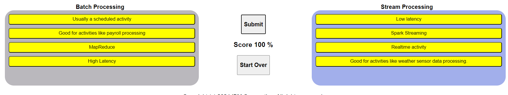

- [1. ETL and ELT Processes](#1-etl-and-elt-processes)
  - [1.1. ETL Fundamental](#11-etl-fundamental)
    - [1.1.1. Extract](#111-extract)
    - [1.1.2. Transform](#112-transform)
    - [1.1.3. Load](#113-load)
    - [1.1.4. ETL use cases](#114-etl-use-cases)
  - [1.2. ELT basics](#12-elt-basics)
    - [1.2.1. Difference with ETL](#121-difference-with-etl)
    - [1.2.2. ELT use cases](#122-elt-use-cases)
    - [1.2.3. Why ELT is trending?](#123-why-elt-is-trending)
  - [1.3. Comparing ETL and ELT](#13-comparing-etl-and-elt)
    - [1.3.1. Difference](#131-difference)
    - [1.3.2. Exploring data and Time to have information](#132-exploring-data-and-time-to-have-information)
    - [1.3.3. The trending shift from ETL to ELT](#133-the-trending-shift-from-etl-to-elt)
  - [1.4. Data Extraction Techniques](#14-data-extraction-techniques)
    - [1.4.1. Raw data](#141-raw-data)
    - [1.4.2. Techniques](#142-techniques)
  - [1.5. Data Transformation Techniques](#15-data-transformation-techniques)
    - [1.5.1. Transformation process](#151-transformation-process)
    - [1.5.2. Schema-on-write and Schema-on-read](#152-schema-on-write-and-schema-on-read)
    - [1.5.3. Lost information while transformation](#153-lost-information-while-transformation)
  - [1.6. Data Loading Techniques](#16-data-loading-techniques)
    - [1.6.1. Các chiến lược tải dữ liệu](#161-các-chiến-lược-tải-dữ-liệu)
    - [1.6.2. Stream Loading and Batch Loading](#162-stream-loading-and-batch-loading)
    - [1.6.3. Push and Pull](#163-push-and-pull)
    - [1.6.4. Serial Loading and Parallel Loading](#164-serial-loading-and-parallel-loading)
- [2. ETL using Shell Scripts](#2-etl-using-shell-scripts)
  - [2.1 Mục tiêu và nhiệm vụ](#21-mục-tiêu-và-nhiệm-vụ)
  - [2.2. Extract](#22-extract)
  - [2.3. Transform](#23-transform)
  - [2.4. Load](#24-load)
  - [2.5. Hands-on](#25-hands-on)
    - [2.5.1 EXTRACTING DATA USING 'CUT' COMMAND](#251-extracting-data-using-cut-command)
    - [2.5.2. TRANSFORMING USING 'tr'](#252-transforming-using-tr)
    - [2.5.3. Starting with PostgreSQL](#253-starting-with-postgresql)
    - [2.5.4. Loading data into a PostreSQL table](#254-loading-data-into-a-postresql-table)
  - [2.6. Practice](#26-practice)
- [3. Data Pipeline](#3-data-pipeline)
  - [3.1. Pipeline](#31-pipeline)
  - [3.2. Data pipeline](#32-data-pipeline)
  - [3.3. Data pipeline performance](#33-data-pipeline-performance)
  - [3.4. Application of data pipeline](#34-application-of-data-pipeline)
  - [3.5. Key Data Pipeline Process](#35-key-data-pipeline-process)
  - [3.6. Batch vs Streaming Data Pipeline Use Case](#36-batch-vs-streaming-data-pipeline-use-case)
    - [3.6.1. Batch Data Pipeline](#361-batch-data-pipeline)
    - [3.6.2. Streaming Data Pipeline](#362-streaming-data-pipeline)
    - [3.6.3. Micro-batch Processing](#363-micro-batch-processing)
    - [3.6.4. Lambda Architecture](#364-lambda-architecture)
      - [3.6.4.1. Advantages](#3641-advantages)
      - [3.6.4.2. Disadvantages](#3642-disadvantages)
      - [3.6.4.3. Examples](#3643-examples)
  - [3.7. Data Pipeline Tools and Technologies](#37-data-pipeline-tools-and-technologies)
    - [3.7.1. Open-source Tools](#371-open-source-tools)


# 1. ETL and ELT Processes

## 1.1. ETL Fundamental

ETL là viết tắt của Extract (Trích Xuất), Transform (Chuyển Đổi) và Load (Nạp Dữ Liệu). ETL là một phương pháp tự động hóa quy trình kỹ thuật dữ liệu, trong đó dữ liệu được thu thập và chuẩn bị cho việc sử dụng tiếp theo trong môi trường phân tích, như data warehouse (kho dữ liệu) hoặc data mart. ETL đề cập đến quá trình thu thập dữ liệu từ nhiều nguồn khác nhau, chuyển đổi chúng thành một định dạng hoặc cấu trúc thống nhất, và sau đó nạp dữ liệu đã chuyển đổi vào môi trường mới.

### 1.1.1. Extract

Trích xuất dữ liệu là quá trình truy cập và đọc dữ liệu vào một ứng dụng. Thông thường đây là một quá trình tự động. Một số phương pháp phổ biến bao gồm:

- Web scraping, nơi dữ liệu được trích xuất từ các trang web bằng cách sử dụng các ứng dụng như Python hoặc R để phân tích mã HTML.
- Sử dụng APIs để kết nối và truy vấn dữ liệu một cách tự động.

### 1.1.2. Transform

Chuyển đổi dữ liệu, còn được gọi là xử lý dữ liệu, có nghĩa là xử lý dữ liệu để nó phù hợp với hệ thống đích và mục đích sử dụng của dữ liệu. Chuyển đổi có thể bao gồm các quá trình như:

- Làm sạch dữ liệu: sửa lỗi hoặc xử lý giá trị thiếu.
- Lọc: chọn lọc những gì cần thiết.
- Kết hợp nguồn dữ liệu khác nhau: hợp nhất dữ liệu liên quan.
- Tạo chỉ số hoặc KPI: phục vụ cho dashboard hoặc học máy.

### 1.1.3. Load

Thông thường, nạp dữ liệu chỉ đơn giản là ghi dữ liệu vào một môi trường đích mới, chẳng hạn như cơ sở dữ liệu, kho dữ liệu hoặc data mart. Mục tiêu chính của nạp dữ liệu là làm cho dữ liệu sẵn sàng để được các ứng dụng phân tích tiếp nhận, giúp người dùng cuối có thể khai thác giá trị từ nó.

### 1.1.4. ETL use cases

ETL có nhiều ứng dụng trong việc chuyển đổi và chuẩn bị dữ liệu từ các nguồn khác nhau để phục vụ cho các hệ thống phân tích và quyết định, như OLAP, dashboards, và mô hình học máy.

Trong đó OLAP là công nghệ giúp thực hiện phân tích dữ liệu phức tạp từ các cơ sở dữ liệu đa chiều.

## 1.2. ELT basics

### 1.2.1. Difference with ETL

ELT (Extract, Load, Transform) là một phương pháp tự động hóa quy trình xử lý dữ liệu, tương tự như ETL, nhưng thứ tự các giai đoạn được thực hiện khác nhau. Với ELT, dữ liệu được trích xuất và tải trực tiếp vào môi trường đích như là data lake. Sau khi dữ liệu đã được lưu trữ, nó có thể được biến đổi theo nhu cầu của người dùng.

Như trong ETL, giai đoạn đầu tiên của ELT là trích xuất (extraction). Dữ liệu được thu thập từ nhiều nguồn và thường được xử lý không đồng bộ vào ứng dụng. Giai đoạn tải (loading) sẽ tải dữ liệu thô trực tiếp vào môi trường đích, nơi các công cụ phân tích hiện đại có thể được sử dụng trực tiếp để xử lý dữ liệu. 

Giai đoạn biến đổi (transformation) trong ELT linh hoạt hơn so với ETL truyền thống. Các công cụ phân tích hiện đại trong môi trường đích cho phép khám phá và trực quan hóa dữ liệu một cách tương tác, bao gồm các phân tích tiên tiến như mô hình hóa và dự đoán.

### 1.2.2. ELT use cases

Các trường hợp sử dụng của ELT thường nằm trong lĩnh vực tính toán hiệu năng cao và big data. ELT rất phù hợp khi xử lý những biến động lớn trong quy mô dữ liệu, phân tích dữ liệu theo thời gian thực từ luồng dữ liệu lớn và khi dữ liệu được phân phối trên toàn cầu.

Trong các quy trình này, tốc độ di chuyển dữ liệu thường là điểm nghẽn lớn hơn so với xử lý dữ liệu. Vì vậy, ELT trở thành lựa chọn tốt khi cần sự linh hoạt trong việc xây dựng các sản phẩm dữ liệu từ cùng một nguồn dữ liệu.

### 1.2.3. Why ELT is trending?

Vậy tại sao ELT lại nổi lên như một xu hướng mới? Đầu tiên, các giải pháp cloud computing đang phát triển nhanh chóng nhờ nhu cầu của big data. Các nền tảng cloud có thể dễ dàng xử lý khối lượng dữ liệu lớn không đồng bộ và phân tán toàn cầu. Các tài nguyên tính toán trên cloud có khả năng mở rộng linh hoạt và bạn chỉ trả tiền cho những gì bạn sử dụng, không lo lãng phí tài nguyên. Điều này giúp ELT có thể tách biệt rõ ràng giữa việc di chuyển và xử lý dữ liệu, đồng thời phù hợp để xử lý các trường hợp thách thức nhất.

Cuối cùng, vì bạn làm việc với bản sao của dữ liệu gốc, không có sự mất mát thông tin. Các biến đổi dữ liệu có thể dẫn đến mất mát thông tin, nhưng với ELT, bạn có thể giữ lại dữ liệu gốc và áp dụng các biến đổi mà không lo bị mất mát thông tin.

## 1.3. Comparing ETL and ELT

### 1.3.1. Difference

Sự khác biệt giữa ETL và ELT nằm ở thứ tự thực hiện các biến đổi. Với ETL, quá trình biến đổi dữ liệu diễn ra trong pipeline trước khi dữ liệu đến đích. Ngược lại, ELT tách rời quá trình biến đổi khỏi pipeline và thực hiện biến đổi trực tiếp tại môi trường đích theo nhu cầu.

Hai phương pháp cũng khác nhau về mức độ linh hoạt. ETL thường là một quy trình cố định, phục vụ cho một chức năng cụ thể. Trong khi đó, ELT linh hoạt hơn, cho phép dữ liệu có sẵn để phân tích tự phục vụ (self-serve analytics).

ETL thường xử lý dữ liệu có cấu trúc trong cơ sở dữ liệu quan hệ, và các tài nguyên tính toán tại chỗ (on-premises) hỗ trợ quy trình làm việc. Điều này có thể gây ra vấn đề về khả năng mở rộng. Ngược lại, ELT có thể xử lý bất kỳ loại dữ liệu nào, cả có cấu trúc lẫn không có cấu trúc, và sử dụng khả năng mở rộng theo yêu cầu của các dịch vụ điện toán đám mây để giải quyết vấn đề về quy mô lớn của dữ liệu.

### 1.3.2. Exploring data and Time to have information

Về khám phá dữ liệu và thời gian để có được thông tin, các pipeline ETL mất thời gian và công sức để sửa đổi, nghĩa là người dùng phải chờ đợi đội ngũ phát triển thực hiện thay đổi theo yêu cầu của họ. ELT lại cung cấp sự linh hoạt cao hơn; với một chút đào tạo về các ứng dụng phân tích hiện đại, người dùng có thể dễ dàng kết nối và khám phá dữ liệu thô, tạo dashboard và chạy mô hình dự đoán theo ý mình.

### 1.3.3. The trending shift from ETL to ELT

ELT được xem như là một sự phát triển tự nhiên từ ETL. Một trong những yếu tố thúc đẩy sự phát triển này là nhu cầu mở rộng quyền truy cập dữ liệu thô cho nhiều đối tượng người dùng hơn trong doanh nghiệp. Trong các quy trình ETL truyền thống, thường có một khu vực lưu trữ trung gian gọi là staging area, nơi dữ liệu thô được lưu trữ tạm thời trước khi được biến đổi và tải vào các hệ thống như data warehouse hoặc data mart. Điều này nghe có vẻ giống với ELT, và staging area trong bối cảnh hiện đại được xem như một data lake - nơi lưu trữ và thao tác dữ liệu thô phục vụ cho phân tích tự phục vụ.

Tuy nhiên, staging area truyền thống thường không được chia sẻ trên toàn công ty. Nó là một khu vực riêng biệt dành cho việc phát triển, theo dõi và tinh chỉnh hiệu suất của pipeline và các quá trình biến đổi dữ liệu đã được xây dựng sẵn. Cùng với sự phát triển của các công cụ phân tích, việc truy cập vào các nguồn dữ liệu thô trở nên dễ dàng hơn đối với những người dùng ít hiểu biết kỹ thuật hơn, dẫn đến sự chuyển đổi sang các nền tảng dữ liệu tự phục vụ.

Mặc dù ETL truyền thống vẫn còn ứng dụng và sẽ không biến mất trong tương lai gần, nhưng có một xu hướng chuyển dịch dần sang ELT. Xu hướng này được thúc đẩy bởi những điểm mà ELT giải quyết, chẳng hạn như thời gian để có được thông tin kéo dài, những thách thức về khả năng mở rộng do big data đặt ra, và tính chất siloed (việc dữ liệu hoặc quy trình bị cô lập trong các hệ thống hoặc phòng ban riêng lẻ, không được chia sẽ hay dễ dàng truy cập từ các phần khác của tổ chức) của dữ liệu trong các hệ thống truyền thống.

## 1.4. Data Extraction Techniques

### 1.4.1. Raw data

Dưới đây là một số ví dụ về nguồn dữ liệu thô:

- Văn bản và hình ảnh đã lưu trữ từ các tài liệu giấy và PDF.
- Trang web, bao gồm văn bản, bảng, hình ảnh và liên kết.
- Âm thanh và video analog, có thể được ghi lại trên các phương tiện như băng từ, hoặc phát trực tiếp.
- Dữ liệu khảo sát, thống kê và kinh tế, cùng với dữ liệu giao dịch từ doanh nghiệp, tài chính, bất động sản và các giao dịch tại điểm bán hàng (POS).

Dữ liệu sự kiện như luồng truyền thông xã hội, dữ liệu thời tiết từ các mạng trạm thời tiết, luồng cảm biến Internet of Things (IoT). Hồ sơ y tế, chẳng hạn như lịch sử kê đơn, điều trị y tế và hình ảnh y khoa, và dữ liệu di truyền cá nhân được mã hóa trong các mẫu DNA và RNA.

Rõ ràng, dữ liệu có mặt ở khắp nơi và nhiều trong số đó rất nhạy cảm và cá nhân, cần được bảo mật chặt chẽ vì các lý do bảo mật và các mối quan tâm khác.

### 1.4.2. Techniques

Có nhiều kỹ thuật để trích xuất dữ liệu, tùy thuộc vào loại nguồn dữ liệu và mục đích sử dụng. Các ví dụ bao gồm nhận dạng ký tự quang học (OCR), dùng để diễn giải và số hóa văn bản quét từ các tài liệu giấy để lưu trữ dưới dạng tệp có thể đọc trên máy tính. Bộ chuyển đổi tương tự sang số (ADC) có thể số hóa âm thanh ghi và tín hiệu analog, và các thiết bị cặp điện tích (CCD) chụp và số hóa hình ảnh.

Các kỹ thuật khác bao gồm web scraping dùng để thu thập dữ liệu từ các trang web, tìm kiếm văn bản, hình ảnh, bảng và liên kết. API, có sẵn để trích xuất dữ liệu từ các kho lưu trữ và luồng trực tuyến như các cơ quan thống kê chính phủ, thư viện, mạng thời tiết, mua sắm trực tuyến và mạng xã hội. Ngôn ngữ SQL để truy vấn cơ sở dữ liệu quan hệ và NoSQL để truy vấn các kho dữ liệu không có cấu trúc.

Một số trường hợp sử dụng cấp cao kèm theo nguồn dữ liệu thô và kỹ thuật trích xuất bao gồm: sử dụng API để trích xuất dữ liệu từ nhiều nguồn có cấu trúc và tích hợp chúng vào một kho lưu trữ trung tâm, hoặc sử dụng thiết bị tính toán biên (edge computing) để giảm khối lượng dữ liệu bằng cách trích xuất các đặc điểm cần thiết từ dữ liệu thô.

## 1.5. Data Transformation Techniques

### 1.5.1. Transformation process

Chuyển đổi dữ liệu chủ yếu liên quan đến việc định dạng dữ liệu để phù hợp với ứng dụng. Điều này có thể bao gồm nhiều loại thao tác, như:

- **Định kiểu dữ liệu (data typing)**: Chuyển đổi dữ liệu sang các kiểu phù hợp như số nguyên, số thực, chuỗi, đối tượng, và danh mục.
- **Cấu trúc hóa dữ liệu (data structuring)**: Chuyển đổi từ định dạng này sang định dạng khác, ví dụ từ JSON, XML hoặc CSV sang bảng cơ sở dữ liệu.
- **Ẩn danh và mã hóa**: Giúp đảm bảo tính riêng tư và an ninh.
- **Làm sạch dữ liệu (cleaning)**: Loại bỏ các bản ghi trùng lặp và điền các giá trị còn thiếu.
- **Chuẩn hóa dữ liệu (normalizing)**: Đảm bảo các đơn vị đo lường tương đương, chẳng hạn sử dụng cùng một loại tiền tệ.
- **Lọc, sắp xếp, tổng hợp và phân loại**: Giúp truy cập dữ liệu đúng mức chi tiết và theo thứ tự hợp lý.
- Ghép nối hoặc kết hợp các nguồn dữ liệu khác biệt.

### 1.5.2. Schema-on-write and Schema-on-read

**SCHEMA-ON-WRITE**

Schema-on-write là phương pháp truyền thống được sử dụng trong các pipeline ETL, nơi dữ liệu phải tuân theo một schema đã định nghĩa trước khi được nạp vào một môi trường đích, chẳng hạn như cơ sở dữ liệu quan hệ. Mục đích là đảm bảo dữ liệu được cấu trúc nhất quán để tăng độ ổn định và giúp các truy vấn sau đó nhanh hơn. Tuy nhiên, điều này cũng giới hạn tính linh hoạt của dữ liệu.

**SCHEMA-ON-READ**

Ngược lại, schema-on-read liên quan đến cách tiếp cận ELT hiện đại, nơi schema được áp dụng cho dữ liệu thô sau khi đọc từ kho lưu trữ dữ liệu thô. Cách tiếp cận này linh hoạt hơn vì có thể tạo ra nhiều dạng nhìn khác nhau của cùng một nguồn dữ liệu thông qua các schema ad hoc. Người dùng có thể truy cập nhiều dữ liệu hơn, vì không cần phải trải qua bước tiền xử lý nghiêm ngặt.

**VÍ DỤ**

- Quy trình Schema-on-Write:

  1. Extract (Trích xuất): Dữ liệu được trích xuất từ các hệ thống giao dịch khác nhau như hệ thống POS (Point of Sale), hệ thống CRM (Customer Relationship Management).
  2. Transform (Chuyển đổi): Dữ liệu thô từ các nguồn khác nhau được chuyển đổi để phù hợp với cấu trúc của schema đã định nghĩa. Ví dụ, thông tin khách hàng có thể được chuẩn hóa, các trường dữ liệu có thể được đổi tên hoặc tính toán các giá trị tổng hợp.
  3. Load (Nạp dữ liệu): Dữ liệu đã chuyển đổi được nạp vào data warehouse, tuân theo một schema cụ thể (ví dụ: bảng `Customers`, `Orders`, `Products` với các mối quan hệ được định nghĩa rõ ràng).

  Đặc điểm:

  - Dữ liệu chỉ có thể được truy vấn sau khi đã tuân theo schema xác định trước.
  - Schema này được định nghĩa trước và không thay đổi trong quá trình truy vấn.
  - Thích hợp cho các trường hợp mà dữ liệu cần phải có cấu trúc rõ ràng và ổn định, ví dụ: các báo cáo kinh doanh định kỳ.

- Quy trình Schema-on-Read:

  Tình huống: Một công ty công nghệ có một kho dữ liệu lớn (data lake) chứa các tập dữ liệu thô từ nhiều nguồn khác nhau, bao gồm cả log dữ liệu từ các ứng dụng, dữ liệu cảm biến IoT, và các tập tin CSV từ đối tác. Các nhà phân tích dữ liệu trong công ty muốn truy cập và phân tích dữ liệu này mà không cần phải trải qua quá trình chuyển đổi dữ liệu trước đó.

  1. Data Storage (Lưu trữ dữ liệu): Dữ liệu thô từ các nguồn khác nhau được nạp vào một kho dữ liệu mà không có bất kỳ sự chuyển đổi hay áp dụng schema trước nào. Dữ liệu được lưu trữ dưới dạng không có cấu trúc hoặc bán cấu trúc như JSON, CSV, log files, vv.
  2. Schema-on-Read: Khi một nhà phân tích cần phân tích dữ liệu, họ sẽ áp dụng một schema ad hoc (schema tùy chỉnh) khi đọc dữ liệu. Ví dụ, một nhà phân tích có thể quyết định tạo một bảng từ dữ liệu JSON để thực hiện phân tích hoặc tạo ra các quan hệ giữa các tập dữ liệu mà họ quan tâm.
  3. Querying (Truy vấn): Nhà phân tích có thể tạo nhiều schema khác nhau dựa trên cùng một tập dữ liệu thô để phục vụ cho các mục đích phân tích khác nhau mà không cần thay đổi dữ liệu gốc.

  Đặc điểm:

  - Dữ liệu được lưu trữ dưới dạng thô, không bị biến đổi hoặc mất mát thông tin.
  - Schema được áp dụng khi dữ liệu được đọc hoặc truy vấn, cung cấp sự linh hoạt trong phân tích.
  - Thích hợp cho các tình huống mà người dùng muốn khám phá, phân tích dữ liệu theo nhiều cách khác nhau mà không bị giới hạn bởi một schema cố định.

### 1.5.3. Lost information while transformation

Việc mất thông tin trong quá trình chuyển đổi có thể xảy ra một cách cố ý hoặc ngẫu nhiên. Chúng ta có thể hình dung sự mất mát này như sau: Dữ liệu thô thường lớn hơn nhiều so với dữ liệu đã chuyển đổi. Vì dữ liệu thường chứa nhiều nhiễu và dư thừa, chúng ta có thể coi nội dung thông tin của dữ liệu như một tập hợp con đúng của dữ liệu. Do đó, việc giảm khối lượng dữ liệu cũng có thể đồng nghĩa với việc giảm nội dung thông tin. Đối với các quy trình ETL, thông tin bị mất có thể hoặc không thể phục hồi, trong khi với ELT, tất cả nội dung thông tin ban đầu vẫn được giữ nguyên vì dữ liệu chỉ đơn giản là được sao chép sang môi trường mới.

Các ví dụ về cách thông tin có thể bị mất trong quá trình chuyển đổi dữ liệu bao gồm:

- **Nén dữ liệu mất mát (lossy compression)**: Ví dụ, chuyển đổi giá trị số thực sang số nguyên, giảm bit rate trong âm thanh hoặc video.
- **Lọc dữ liệu (filtering)**: Thường là một lựa chọn tạm thời của một tập hợp con dữ liệu, nhưng khi nó trở thành vĩnh viễn, thông tin có thể bị loại bỏ.
- **Tổng hợp dữ liệu (aggregation)**: Ví dụ, tổng hợp doanh thu hàng năm so với trung bình doanh thu hàng ngày hoặc hàng tháng.
- **Thiết bị tính toán biên (edge computing)**: Ví dụ, cảnh báo sai trong các thiết bị giám sát chỉ truyền các tín hiệu báo động mà không truyền dữ liệu thô.

## 1.6. Data Loading Techniques

### 1.6.1. Các chiến lược tải dữ liệu

**FULL LOADING**

Sử dụng khi bạn muốn bắt đầu theo dõi các giao dịch trong một data warehouse mới hoặc khi bạn muốn tải lịch sử ban đầu vào cơ sở dữ liệu. Trong quá trình này, không có dữ liệu hiện có trong kho lưu trữ trước khi tải đầy đủ. Sau khi tải đầy đủ hoàn thành, bạn có thể sử dụng chiến lược tải dữ liệu tăng dần.

Ví dụ: Một công ty bán lẻ quyết định triển khai một data warehouse mới để theo dõi lịch sử bán hàng của họ trong 10 năm qua. Công ty này có hàng triệu bản ghi giao dịch từ các hệ thống bán lẻ trước đó. Họ quyết định sử dụng phương pháp Full Loading để tải toàn bộ dữ liệu lịch sử vào data warehouse mới. Quá trình này chỉ diễn ra một lần, và sau khi hoàn thành, toàn bộ lịch sử giao dịch được lưu trữ trong kho dữ liệu.

**INCREMENtAL LOADING**

Dữ liệu được thêm vào cơ sở dữ liệu mà không ghi đè lên các dữ liệu đã có. Điều này hữu ích trong việc tích lũy lịch sử giao dịch. Tải dữ liệu tăng dần có thể được phân loại thành Stream Loading và Batch Loading.

Ví dụ: Sau khi kho dữ liệu bán lẻ đã được tải đầy đủ với lịch sử giao dịch, công ty quyết định chỉ tải dữ liệu giao dịch mới phát sinh từ ngày hôm qua trở đi vào data warehouse mỗi ngày. Đây là phương pháp Incremental Loading, nơi chỉ những dữ liệu mới hoặc đã thay đổi kể từ lần tải cuối cùng mới được tải vào kho dữ liệu mà không ghi đè lên dữ liệu cũ.

### 1.6.2. Stream Loading and Batch Loading

**STREAM LOADING**

Dữ liệu được cập nhật liên tục vào kho lưu trữ hoặc các hệ thống lưu trữ khác khi dữ liệu mới đến. Thường được kích hoạt bởi các sự kiện, như dữ liệu thời gian thực từ cảm biến, luồng mạng xã hội, và thiết bị IoT.

Ví dụ: Một công ty cung cấp dịch vụ Internet of Things (IoT) có các cảm biến theo dõi nhiệt độ trong các kho lạnh. Dữ liệu nhiệt độ từ các cảm biến này được gửi liên tục về hệ thống phân tích dữ liệu thời gian thực để giám sát và kiểm soát điều kiện môi trường. Dữ liệu này được xử lý và lưu trữ ngay khi nó đến thông qua phương pháp Stream Loading.

**BATCH LOADING**

Dữ liệu được cập nhật định kỳ, chẳng hạn như cập nhật hàng ngày, hàng giờ hoặc hàng tuần. Dữ liệu theo lô có thể được lên lịch, ví dụ như sử dụng Windows Task Scheduler hoặc Cron jobs trong Linux.

Ví dụ: Một công ty tài chính cập nhật dữ liệu về tài khoản khách hàng hàng ngày. Hàng đêm, một job batch được chạy để tải dữ liệu giao dịch của ngày hôm trước vào hệ thống quản lý dữ liệu trung tâm. Dữ liệu này được tải theo từng lô lớn, mỗi lô đại diện cho toàn bộ giao dịch trong một ngày.

### 1.6.3. Push and Pull

**PUSH**

Nguồn dữ liệu đẩy dữ liệu vào data warehouse hoặc kho lưu trữ khác. Thường được sử dụng trong stream loading và đặc biệt hữu ích cho dữ liệu thời gian thực.

Ví dụ: Một trang web thương mại điện tử đẩy dữ liệu giao dịch trực tiếp từ hệ thống POS vào data warehouse ngay khi một giao dịch được hoàn tất. Điều này cho phép hệ thống dữ liệu nhận được thông tin theo thời gian thực, giúp đội ngũ phân tích có thể nhanh chóng nhận được các báo cáo cập nhật.

**PULL**

Data warehouse kéo dữ liệu từ nguồn bằng cách đăng ký nhận dữ liệu. Phù hợp cho các giao dịch có lịch trình và tải dữ liệu theo lô.

Ví dụ: Một công ty năng lượng có các trạm phát điện ở nhiều nơi khác nhau. Hàng ngày, hệ thống quản lý dữ liệu trung tâm sẽ "kéo" dữ liệu sản xuất điện từ các trạm này về thông qua một quá trình tự động được thiết lập trước đó. Quá trình này giúp công ty có thể tổng hợp dữ liệu từ các nguồn phân tán mà không cần các trạm phải chủ động gửi dữ liệu.

### 1.6.4. Serial Loading and Parallel Loading

**SERIAL LOADING**

Dữ liệu được sao chép tuần tự, từng phần một. Đây là cách dữ liệu thường được tải vào data warehouse theo mặc định.

Ví dụ: Một công ty bảo hiểm tải dữ liệu về các hợp đồng bảo hiểm từ nhiều nguồn khác nhau, nhưng họ tải từng nguồn dữ liệu một lần. Dữ liệu từ từng nguồn sẽ được xử lý và lưu trữ tuần tự, từng phần một, cho đến khi toàn bộ dữ liệu từ tất cả các nguồn được tải xong.

**PARALLEL LOADING**

Dữ liệu được tải từ nhiều nguồn hoặc chia nhỏ dữ liệu từ một nguồn thành các phần và tải chúng đồng thời. So với tải tuần tự, tải song song nhanh hơn và tối ưu hơn, đặc biệt là khi dữ liệu lớn hoặc phải di chuyển qua các khoảng cách xa.

Ví dụ: Một công ty logistics có dữ liệu từ nhiều khu vực khác nhau cần được tải vào kho dữ liệu trung tâm. Thay vì tải từng khu vực một cách tuần tự, họ chia dữ liệu từ mỗi khu vực thành các phần nhỏ hơn và tải chúng đồng thời vào hệ thống. Điều này giúp tăng tốc quá trình tải dữ liệu và giảm thời gian chờ đợi.

# 2. ETL using Shell Scripts


## 2.1 Mục tiêu và nhiệm vụ

Thực hiện một pipeline ETL và giải thích cách lập lịch cho các script hoặc tác vụ ETL.

Yêu cầu: Báo cáo trung bình, tối thiểu và tối đa nhiệt độ hàng giờ từ cảm biến từ xa, sau đó gửi kết quả lên dashboard mỗi phút. Bạn được cung cấp các API để đọc nhiệt độ và nạp thống kê vào hệ thống báo cáo.


## 2.2. Extract

- Lấy dữ liệu nhiệt độ hiện tại từ cảm biến bằng cách sử dụng API `get_temp_api`. 
- Tạo một file log temperature.log để lưu trữ các đọc nhiệt độ.
- Chỉ cần giữ lại các đọc của giờ gần nhất, do đó, bạn cần đệm 60 đọc và ghi đè file log bằng các đọc này.

## 2.3. Transform

Tính toán các thống kê nhiệt độ từ log 60 phút và tải các thống kê này vào hệ thống báo cáo bằng API `load_stats_api`.

Viết một script Python `get_stats.py` để tính toán các thống kê từ `temperature.log` và lưu kết quả vào file `temp_stats.csv.`

```bash
python3 get_stats.py temperature.log temp_stats.csv
```

## 2.4. Load

Nạp các thống kê vào hệ thống báo cáo. Sử dụng API `load_stats_api` để nạp dữ liệu từ `temp_stats.csv.`

## 2.5. Hands-on

Tạo file script

```bash
touch Temperature_ETL.sh
```

```bash
#!/bin/bash

# Đọc nhiệt độ từ cảm biến và ghi vào log
temperature=$(get_temp_api)
echo $temperature >> temperature.log

# Giữ lại 60 dòng gần nhất trong log
tail -n 60 temperature.log > temperature.log

# Tính toán thống kê nhiệt độ và lưu vào file CSV
python3 get_stats.py temperature.log temp_stats.csv

# Nạp thống kê vào hệ thống báo cáo
load_stats_api temp_stats.csv
```

### 2.5.1 EXTRACTING DATA USING 'CUT' COMMAND

The command below shows how to extract the first four characters.

```bash
echo "database" | cut -c1-4
```

```
data
```

The command below shows how to extract 5th to 8th characters.

```bash
echo "database" | cut -c5-8
```

```
base
```

Non-contiguous characters can be extracted using the comma.

The command below shows how to extract the 1st and 5th characters.

```bash
echo "database" | cut -c1,5
```

```
db
```

Có thể trích xuất một cột hay trường đặc biệt được phân tách cụ thể bằng cách:

- the delimiter using the -d option, or
- the field number using the -f option.

Ví dụ: `/etc/passwd` có các trường được phân tách bởi dấu `:`

Lấy ra cột đầu tiên của file ` /etc/passwd`

```bash
cut -d":" -f1 /etc/passwd
```

Có thể lấy ra một lần nhiều cột, trường của file

Lấy ra cột 1, 3, 6 (username, userid, home directory) từ `/etc/passwd`

```bash
cut -d":" -f1,3,6 /etc/passwd
```

Tương tự, câu lệnh dưới lấy dữ liệu từ cột 3 đến cột 6

```bash
cut -d":" -f3-6 /etc/passwd
```

### 2.5.2. TRANSFORMING USING 'tr'

`tr` dùng để **dịch, nén hay xóa** kí tự

Dịch một bộ ký tự sang cái khác: Chuyển chữ thường thành chữ hoa

```bash
echo "Shell Scripting" | tr "[a-z]" "[A-Z]"
```

```
SHELL SCRIPTING
```

Có thể thay `"[a-z]"` thành `"[:lower:]"` và `"[A-Z]"` thành `"[:upper:]"`

Nén những dữ liệu bị lặp lại ví dụ như sau khi gõ `ps` thì ta được

```
    PID TTY          TIME CMD
    527 pts/3    00:00:00 bash
   1424 pts/3    00:00:00 ps
```

Ta có thể nén lại với tùy chọn `-s`

```bash
ps | tr -s " "
```

Lúc này đầu ra sẽ là

```
 PID TTY TIME CMD
 527 pts/3 00:00:00 bash
 1342 pts/3 00:00:00 ps
 1343 pts/3 00:00:00 tr
```

Trong ví dụ trên ký tự khoảng trắng trong dấu ngoặc kép có thể được thay thế bằng `"[:space:]"`

Ta có thể xóa đi những ký tự được chỉ định với tùy chọn `-d`

Câu lệnh dưới đây sẽ xóa đi các ký tự số

```bash
echo "My login pin is 1234" | tr -d "[:digit:]"
```
```
My login pin is
```

### 2.5.3. Starting with PostgreSQL

Create table named `user` với các cột `uname`, `uid`, `home` và kết nối với database `template1`.

```SQL
\c template1

create table users(username varchar(50),userid int,homedirectory varchar(100));
```

### 2.5.4. Loading data into a PostreSQL table

Tạo một script chuyển dữ liệu từ file csv vào database

```bash
touch csv2db.sh
```

Nhớ rằng username là cột 1, userid là cột 3 và home directory là cột 6

```sh
# This script
# Extracts data from /etc/passwd file into a CSV file.

# The csv data file contains the user name, user id and
# home directory of each user account defined in /etc/passwd

# Transforms the text delimiter from ":" to ",".
# Loads the data from the CSV file into a table in PostgreSQL database.

echo "Extracting data"

# column 1, 3, 6 are columns

cut -d ":" -f1,3,6 /etc/passwd
```

Sau khi chạy thử ta đã nhận được

```
Extracting data
root:0:/root
daemon:1:/usr/sbin
bin:2:/bin
sys:3:/dev
sync:4:/bin
games:5:/usr/games
man:6:/var/cache/man
lp:7:/var/spool/lpd
mail:8:/var/mail
news:9:/var/spool/news
uucp:10:/var/spool/uucp
proxy:13:/bin
www-data:33:/var/www
backup:34:/var/backups
list:38:/var/list
irc:39:/run/ircd
gnats:41:/var/lib/gnats
nobody:65534:/nonexistent
_apt:100:/nonexistent
systemd-network:101:/run/systemd
systemd-resolve:102:/run/systemd
messagebus:103:/nonexistent
systemd-timesync:104:/run/systemd
sshd:105:/run/sshd
theia:1000:/home/theia
cassandra:106:/var/lib/cassandra
mongodb:107:/home/mongodb
```

Vậy ta cần lưu trữ ra 1 file txt để thực hiện quá trình transform

```sh
# This script
# Extracts data from /etc/passwd file into a CSV file.

# The csv data file contains the user name, user id and
# home directory of each user account defined in /etc/passwd

# Transforms the text delimiter from ":" to ",".
# Loads the data from the CSV file into a table in PostgreSQL database.

# Extract phase
echo "Extracting data"

# column 1, 3, 6 are columns

cut -d ":" -f1,3,6 /etc/passwd > extracted-data.txt
```

Để thay đổi cấu trúc file từ `:` sang `,` ta sẽ dùng `tr`

```sh
# This script
# Extracts data from /etc/passwd file into a CSV file.

# The csv data file contains the user name, user id and
# home directory of each user account defined in /etc/passwd

# Transforms the text delimiter from ":" to ",".
# Loads the data from the CSV file into a table in PostgreSQL database.

# Extract phase
echo "Extracting data"

# column 1, 3, 6 are columns

cut -d ":" -f1,3,6 /etc/passwd > extracted-data.txt

# Transform phase
echo "Transforming data"
tr ":" "," < extracted-data.txt > transformed-data.csv
```

Và file csv có nội dung như sau:

```
root,0,/root
daemon,1,/usr/sbin
bin,2,/bin
sys,3,/dev
sync,4,/bin
games,5,/usr/games
man,6,/var/cache/man
lp,7,/var/spool/lpd
mail,8,/var/mail
news,9,/var/spool/news
uucp,10,/var/spool/uucp
proxy,13,/bin
www-data,33,/var/www
backup,34,/var/backups
list,38,/var/list
irc,39,/run/ircd
gnats,41,/var/lib/gnats
nobody,65534,/nonexistent
_apt,100,/nonexistent
systemd-network,101,/run/systemd
systemd-resolve,102,/run/systemd
messagebus,103,/nonexistent
systemd-timesync,104,/run/systemd
sshd,105,/run/sshd
theia,1000,/home/theia
cassandra,106,/var/lib/cassandra
mongodb,107,/home/mongodb
```

Để load data vào PostreSQL ta chỉ dùng câu lệnh `COPY` là được 

```sql
COPY table_name FROM 'filename' DELIMITERS 'delimiter_character' FORMAT;
```

```sh
# This script
# Extracts data from /etc/passwd file into a CSV file.

# The csv data file contains the user name, user id and
# home directory of each user account defined in /etc/passwd

# Transforms the text delimiter from ":" to ",".
# Loads the data from the CSV file into a table in PostgreSQL database.

# Extract phase
echo "Extracting data"

# column 1, 3, 6 are columns

cut -d ":" -f1,3,6 /etc/passwd > extracted-data.txt

# Transform phase
echo "Transforming data"
tr ":" "," < extracted-data.txt > transformed-data.csv

# Loading phase
echo "Loading data"

export PGPASSWORD=LQsjUoaTnDuPjwB5G8cycXKq

echo "\c template1;\COPY users FROM '/home/project/transformed-data.csv' DELIMITERS ',' CSV;" | psql --username=postgres --host=postgres

echo "SELECT * FROM users;" | psql --username=postgres --host=postgres template1
```

## 2.6. Practice

[File location](https://cf-courses-data.s3.us.cloud-object-storage.appdomain.cloud/IBM-DB0250EN-SkillsNetwork/labs/Bash%20Scripting/ETL%20using%20shell%20scripting/web-server-access-log.txt.gz), use wget to download.

Columns and datatypes

- a. timestamp - TIMESTAMP
- b. latitude - float
- c. longitude - float
- d. visitorid - char(37)
- e. accessed_from_mobile - boolean
- f. browser_code - int

Note: file đã có header nên cần sử dụng tùy chọn `HEADER` trong lệnh `COPY`

Task: Create a table named access_log to store the timestamp, latitude, longitude and visitorid.

```sql
CREATE TABLE access_log(timestamp TIMESTAMP, latitude FLOAT, longitude FLOAT, visitorid CHAR(37));
```

Task: Create script `cp-access-log.sh`

```bash
touch cp-access-log.sh
```

download and unzip file:

```bash
wget ...
gunzip -f web-server-access-log.txt.gz
```

Thực hiện load data từ file đó vào csdl [file sh](/cp-access-log.sh)

# 3. Data Pipeline

## 3.1. Pipeline

Pipeline là gì: Một pipeline là một chuỗi các quy trình được kết nối với nhau theo thứ tự tuần tự. Điều này có nghĩa là đầu ra của một quy trình được chuyển tiếp như đầu vào cho quy trình tiếp theo trong chuỗi.

Một cách để di chuyển các hộp từ nơi này sang nơi khác là có một chuỗi bạn bè, mỗi người chuyển hộp một cách tuần tự từ người này sang người khác. Mỗi người trong chuỗi này là một bộ xử lý, với chức năng tương tự: nhận hộp và chuyển hộp.

## 3.2. Data pipeline

Pipeline dữ liệu là một hệ thống trích xuất dữ liệu và chuyển nó qua các giai đoạn chuyển đổi (nếu có) trước khi tải nó vào một nơi mới hoặc một định dạng mới. Các pipeline dữ liệu thường được điều khiển bởi các quy trình phần mềm như lệnh, chương trình và luồng xử lý.

Ví dụ: Lệnh pipe `|` trong bash của Linux có thể được sử dụng như keo kết nối các quy trình với nhau.

## 3.3. Data pipeline performance

- a. **Latency (Độ trễ)**: Độ trễ là tổng thời gian để một gói dữ liệu đơn lẻ di chuyển qua toàn bộ pipeline. Độ trễ tổng thể bị giới hạn bởi quy trình chậm nhất trong pipeline.

  Ví dụ: Tốc độ tải trang web của bạn phụ thuộc vào tốc độ của máy chủ, bất kể dịch vụ internet của bạn nhanh đến đâu.

- b. **Throughput (Thông lượng)**: Thông lượng là lượng dữ liệu có thể được xử lý qua pipeline trong một đơn vị thời gian. Tăng kích thước gói dữ liệu xử lý trong một đơn vị thời gian có thể tăng thông lượng.

  Ví dụ: Giống như trong việc chuyển các hộp lớn hơn giữa các bạn bè, bạn có thể tăng năng suất nếu giới hạn không vượt quá khả năng của mỗi người.

## 3.4. Application of data pipeline

- **Sao lưu tệp**: Pipeline đơn giản không có chuyển đổi, dùng để sao lưu dữ liệu.
- **Tích hợp dữ liệu**: Kết hợp các nguồn dữ liệu thô khác nhau vào một data lake.
- **Lưu trữ dữ liệu giao dịch**: Di chuyển bản ghi giao dịch vào một data warehouse.
- **Truyền phát dữ liệu**: Streaming dữ liệu từ các thiết bị IoT để hiển thị thông tin trên dashboard hoặc hệ thống học máy.
- **Chuẩn bị dữ liệu**: Chuẩn bị dữ liệu thô cho phát triển hoặc sản xuất học máy.
- **Gửi và nhận thông điệp**: Như email, SMS, hoặc cuộc họp video trực tuyến.

## 3.5. Key Data Pipeline Process

**CÁC QUY TRÌNH CHÍNH**

- **Trích xuất dữ liệu**: Lấy dữ liệu từ một hoặc nhiều nguồn.

  Ví dụ: Một công ty thương mại điện tử cần trích xuất dữ liệu đơn hàng từ hệ thống quản lý bán hàng (Sales Management System) và dữ liệu khách hàng từ cơ sở dữ liệu CRM (Customer Relationship Management).

- **Đưa dữ liệu vào pipeline**: Dữ liệu sau khi trích xuất được đưa vào pipeline để xử lý.

  Ví dụ: Sau khi trích xuất, dữ liệu từ hệ thống bán hàng và CRM được đưa vào pipeline để xử lý thông qua một chương trình hoặc API.

- **Chuyển đổi dữ liệu (nếu cần)**: Dữ liệu có thể được chuyển đổi trong pipeline để phù hợp với yêu cầu đích.

  Ví dụ: Dữ liệu đơn hàng và khách hàng được chuyển đổi, như chuẩn hóa định dạng tên, hợp nhất thông tin từ nhiều nguồn, và tính toán các chỉ số quan trọng như tổng doanh thu hoặc số lượng khách hàng mua hàng lặp lại.

- **Nạp dữ liệu vào nơi đích**: Dữ liệu cuối cùng được đưa vào một hệ thống lưu trữ hoặc đích đến.

  Ví dụ: Sau khi dữ liệu được chuyển đổi, nó được nạp vào một kho dữ liệu (Data Warehouse) để phục vụ cho các báo cáo và phân tích.

- **Lên lịch hoặc kích hoạt các công việc**: Quản lý việc khi nào các công việc trong pipeline sẽ chạy.

  Ví dụ: Công ty lên lịch để pipeline chạy hàng ngày vào lúc nửa đêm để cập nhật dữ liệu mới nhất từ hệ thống bán hàng và CRM.

- **Theo dõi hoạt động của pipeline**: Đảm bảo rằng pipeline hoạt động đúng cách và dữ liệu được xử lý trơn tru.

  Ví dụ: Quản trị viên theo dõi pipeline để đảm bảo dữ liệu được xử lý và nạp vào kho dữ liệu đúng thời gian, và không có lỗi xảy ra trong quá trình.

- **Bảo trì và tối ưu hóa**: Đảm bảo rằng pipeline hoạt động hiệu quả và trơn tru.

  Ví dụ: Sau khi pipeline đã chạy một thời gian, quản trị viên phát hiện một nút thắt cổ chai ở bước chuyển đổi dữ liệu và quyết định tối ưu hóa bằng cách song song hóa xử lý để giảm thời gian chạy.

**CÁC YẾU TỐ CẦN THEO DÕI**

- **Latency (Độ trễ)**: Thời gian cần để các gói dữ liệu di chuyển qua pipeline.

  Ví dụ: Nếu mất quá nhiều thời gian để chuyển đổi dữ liệu đơn hàng, quản trị viên sẽ cần điều chỉnh pipeline để giảm latency.

- **Throughput (Thông lượng)**: Lượng dữ liệu đi qua pipeline trong một đơn vị thời gian.

Ví dụ: Khi lượng dữ liệu tăng lên đáng kể trong ngày lễ mua sắm, pipeline cần được theo dõi để đảm bảo throughput không bị ảnh hưởng, đảm bảo tất cả dữ liệu đều được xử lý kịp thời.

- **Lỗi và sự cố**: Có thể xảy ra do quá tải mạng, hoặc lỗi ở hệ thống nguồn hoặc đích.

  Ví dụ: Nếu pipeline gặp lỗi khi kết nối đến hệ thống CRM do quá tải mạng, quản trị viên cần nhận được cảnh báo và khắc phục ngay lập tức.

- **Tỷ lệ sử dụng tài nguyên**: Đo lường mức độ tài nguyên của pipeline đang được sử dụng, ảnh hưởng đến chi phí.

  Ví dụ: Nếu pipeline chỉ sử dụng 50% công suất của máy chủ, có thể giảm số lượng máy chủ để tiết kiệm chi phí mà vẫn đảm bảo hiệu quả.

- **Hệ thống ghi log và cảnh báo**: Pipeline cần có hệ thống ghi lại các sự kiện và cảnh báo cho quản trị viên khi có lỗi xảy ra.

**GIẢI PHÁP GIẢM THIỂU NÚT THẮT CỔ CHAI**

- **Load Balancing (Cân bằng tải)**: Nếu mỗi gói dữ liệu có sẵn đúng lúc mà không có bước nào bị nhàn rỗi, pipeline sẽ không có nút thắt cổ chai. Điều này đòi hỏi tất cả các bước xử lý gói dữ liệu có cùng thời gian xử lý.
- **Parallelization (Song song hóa)**: Nếu một bước trong pipeline là nút thắt cổ chai, có thể song song hóa bước đó bằng cách chia nhỏ dữ liệu và xử lý đồng thời trên nhiều luồng hoặc CPU.
- **Sử dụng I/O Buffers**: Buffer I/O là các khu vực lưu trữ tạm thời cho dữ liệu giữa các giai đoạn xử lý có thời gian xử lý khác nhau. Buffers giúp điều chỉnh luồng dữ liệu giữa các bước có tốc độ xử lý khác nhau và có thể cải thiện throughput.
- **Nonlinear Pipelines (Pipeline phi tuyến tính)**: Những pipeline có các bước xử lý song song được gọi là phi tuyến tính, khác với các pipeline tuyến tính (serial) truyền thống.

## 3.6. Batch vs Streaming Data Pipeline Use Case



### 3.6.1. Batch Data Pipeline

DP xử lý dữ liệu theo lô. Xem các ví dụ:

- **Sao lưu dữ liệu định kỳ**: Một công ty lưu trữ dữ liệu từ các hệ thống giao dịch của mình vào cuối mỗi ngày làm việc. Toàn bộ dữ liệu giao dịch trong ngày được sao lưu vào một thời điểm cố định, chẳng hạn như lúc nửa đêm. Quá trình này không yêu cầu dữ liệu phải được cập nhật ngay lập tức, và độ chính xác của dữ liệu là rất quan trọng.

- **Dự báo doanh số dài hạn**: Một công ty bán lẻ thu thập dữ liệu doanh số hàng tuần và sử dụng chúng để dự báo doanh số trong vài tháng tới. Dữ liệu được xử lý theo từng tuần, không yêu cầu cập nhật thời gian thực nhưng cần đảm bảo rằng tất cả dữ liệu được làm sạch và chính xác trước khi sử dụng cho dự báo.

### 3.6.2. Streaming Data Pipeline

DP xử lý dữ liệu theo thời gian thực. Xem các ví dụ:

- **Phát hiện gian lận**: Một ngân hàng sử dụng hệ thống phát hiện gian lận thời gian thực để theo dõi các giao dịch thẻ tín dụng của khách hàng. Mỗi giao dịch được xử lý ngay lập tức khi nó xảy ra để phát hiện bất kỳ hành vi đáng ngờ nào và ngăn chặn gian lận trước khi nó xảy ra.

- **Phân tích cảm xúc trên mạng xã hội**: Một công ty tiếp thị sử dụng hệ thống phân tích cảm xúc từ các bài đăng trên mạng xã hội để đo lường phản hồi của người dùng đối với sản phẩm hoặc chiến dịch quảng cáo. Dữ liệu từ các bài đăng được xử lý ngay khi chúng xuất hiện để công ty có thể phản ứng nhanh chóng.

### 3.6.3. Micro-batch Processing

Xử lý theo lô nhỏ, xem các ví dụ:

Ví dụ: Một trang web lớn cần theo dõi hành vi của người dùng trên trang theo thời gian thực để cung cấp đề xuất cá nhân hóa. Thay vì xử lý từng sự kiện riêng lẻ, trang web này thu thập các sự kiện trong các lô nhỏ, chẳng hạn như mỗi 5 giây, và sau đó xử lý chúng. Điều này giúp giảm tải hệ thống mà vẫn đảm bảo dữ liệu được phân tích gần với thời gian thực.

Đây là sự kết hợp giữa batch và stream method, vừa có thể có được dữ liệu theo thời gian thực, và đỡ tốn tài nguyên hơn sử dụng stream hoàn toàn. Có thể xem thêm các ví dụ:

- **Giao dịch tài chính**: Một ngân hàng có thể sử dụng xử lý micro-batch để theo dõi các giao dịch thẻ tín dụng theo từng cụm nhỏ, chẳng hạn như mỗi 10 giây. Điều này cho phép ngân hàng phát hiện các giao dịch gian lận một cách gần như thời gian thực mà không cần phải xử lý từng giao dịch một cách liên tục.
- **Quản lý hàng tồn kho**: Một công ty bán lẻ có thể cập nhật dữ liệu hàng tồn kho trong các khoảng thời gian nhỏ, chẳng hạn như mỗi phút, bằng cách sử dụng micro-batch. Điều này giúp họ theo dõi mức tồn kho của sản phẩm với độ trễ tối thiểu mà không cần phải xử lý thông tin theo thời gian thực hoàn toàn.
- **Hệ thống phân phối nội dung**: Các nền tảng phát video trực tuyến có thể sử dụng micro-batch để phân phối và cập nhật nội dung cho người dùng. Thay vì phát từng gói dữ liệu video theo thời gian thực, nền tảng có thể chia nhỏ video thành các phân đoạn và xử lý chúng theo các đợt nhỏ để cải thiện hiệu suất và giảm thiểu độ trễ.

### 3.6.4. Lambda Architecture

Kiến trúc Lambda là một mô hình kiến trúc xử lý dữ liệu lớn (big data) được thiết kế để xử lý và phân tích dữ liệu theo cả hai phương thức: batch processing (xử lý theo lô) và stream processing (xử lý theo dòng).

**CÁC THÀNH PHẦN CỦA KIẾN TRÚC**

1. **Batch Layer**: Xử lý và lưu trữ dữ liệu lịch sử trong thời gian dài, thường với độ trễ cao hơn nhưng đảm bảo tính toàn vẹn và chính xác cao. `Chức năng`: Tạo ra các mô hình dữ liệu từ dữ liệu quá khứ. Kết quả từ lớp này thường được lưu trữ trong một cơ sở dữ liệu hoặc data warehouse.
2. **Speed Layer**: Xử lý dữ liệu thời gian thực hoặc gần thời gian thực với độ trễ thấp nhất có thể. `Chức năng`: Cung cấp kết quả nhanh chóng từ dữ liệu mới nhất, nhưng có thể chấp nhận một số lỗi hoặc thiếu chính xác. Thông tin từ lớp này thường được sử dụng để bổ sung cho dữ liệu từ batch layer.
3. **Serving Layer**: Kết hợp kết quả từ batch layer và speed layer để cung cấp dữ liệu cuối cùng cho người dùng hoặc hệ thống. `Chức năng`: Tích hợp các dữ liệu từ cả hai lớp để cung cấp thông tin có độ chính xác cao và cập nhật với thời gian thực.

#### 3.6.4.1. Advantages

- **Kết hợp tốc độ và độ chính xác**: Kiến trúc Lambda cho phép xử lý dữ liệu với độ trễ thấp (real-time) trong khi vẫn duy trì được tính toàn vẹn và chính xác của dữ liệu thông qua việc xử lý theo lô.
- **Tính linh hoạt**: Có thể xử lý dữ liệu từ nhiều nguồn khác nhau, phục vụ nhiều mục đích khác nhau.

#### 3.6.4.2. Disadvantages

- **Phức tạp**: Việc thiết kế và duy trì kiến trúc Lambda có thể phức tạp và đòi hỏi nhiều tài nguyên, vì nó kết hợp cả hai loại xử lý.
- **Dư thừa**: Do phải xử lý dữ liệu hai lần (cả theo lô và theo dòng), kiến trúc này có thể dẫn đến sự dư thừa và tăng chi phí tài nguyên.

#### 3.6.4.3. Examples

- **Dự báo thời tiết**: Một hệ thống dự báo thời tiết có thể sử dụng kiến trúc Lambda để thu thập và phân tích dữ liệu thời tiết. Dữ liệu lịch sử về điều kiện thời tiết được xử lý theo lô (batch) để tạo ra các mô hình dự báo, trong khi dữ liệu thời gian thực được xử lý theo dòng (stream) để cập nhật các dự báo với thông tin mới nhất.

- **Phân tích dữ liệu hành vi người dùng**: Một công ty công nghệ có thể sử dụng Lambda Architecture để phân tích hành vi người dùng trên ứng dụng của mình. Dữ liệu lịch sử về tương tác người dùng được xử lý theo lô để xác định các xu hướng dài hạn, trong khi dữ liệu thời gian thực từ các hoạt động hiện tại của người dùng được xử lý theo dòng để cung cấp khuyến nghị hoặc quảng cáo cá nhân hóa ngay lập tức.

- **Quản lý vận tải**: Trong một hệ thống quản lý vận tải, Lambda Architecture có thể được sử dụng để theo dõi và dự báo tình trạng giao thông. Dữ liệu lịch sử về giao thông được xử lý theo lô để tạo ra các mô hình dự báo lưu lượng, trong khi dữ liệu giao thông thời gian thực từ các cảm biến được xử lý theo dòng để cập nhật tình hình và tối ưu hóa tuyến đường ngay lập tức.

## 3.7. Data Pipeline Tools and Technologies

Có rất nhiều công cụ pipeline dữ liệu mã nguồn mở và thương mại cũng như dịch vụ Cloud để bạn lựa chọn. Các tính năng điển hình của các sản phẩm ETL và ELT hiện đại bao gồm:

1. Tạo Pipeline Tự Động: Hầu hết các công cụ hiện đại cho phép tự động hóa việc tạo pipeline từ việc trích xuất dữ liệu đến việc tải dữ liệu vào hệ thống đích.
2. Dễ Sử Dụng: Nhiều công cụ cung cấp giao diện đồ họa kéo và thả (GUI), còn được gọi là ETL không cần mã hóa, giúp người dùng dễ dàng cấu hình các quy tắc và luồng pipeline mà không cần lập trình.
3. Hỗ Trợ Chuyển Đổi Phức Tạp: Các công cụ hiện đại có thể hỗ trợ các phép toán phức tạp như xử lý chuỗi, tính toán, và ghép dữ liệu.
4. Bảo Mật và Tuân Thủ: Các công cụ này mã hóa dữ liệu cả khi đang truyền và lưu trữ, và tuân thủ các quy định ngành và chính phủ như HIPAA và GDPR.

### 3.7.1. Open-source Tools

1. `Python và Pandas`: Python, cùng với thư viện Pandas, là một môi trường lập trình rất phổ biến và linh hoạt để xây dựng pipeline dữ liệu. Pandas sử dụng cấu trúc dữ liệu gọi là DataFrame để xử lý dữ liệu dạng bảng như trong Excel hoặc CSV. Đây là công cụ tuyệt vời để thử nghiệm các pipeline ETL và phân tích dữ liệu khám phá, nhưng có thể gặp khó khăn khi mở rộng dữ liệu lớn vì các thao tác trên DataFrame phải được thực hiện trong bộ nhớ.

    `Ví dụ`: Nếu bạn cần phân tích dữ liệu bán hàng từ các bảng CSV lớn, Pandas có thể giúp bạn dễ dàng xử lý và phân tích dữ liệu này trước khi xuất ra báo cáo.

2. `Dask, Vaex, và Apache Spark`: Những thư viện này hỗ trợ mở rộng lên dữ liệu lớn và cung cấp API tương tự như DataFrame của Pandas, giúp bạn xử lý dữ liệu lớn hơn mà không gặp vấn đề về bộ nhớ.

    `Ví dụ`: Apache Spark có thể được sử dụng để phân tích dữ liệu từ các nguồn lớn như giao dịch bán hàng hàng triệu dòng mỗi ngày.

3. `Apache Airflow`: Là một nền tảng mã nguồn mở cho phép lập trình, lập lịch, và theo dõi các luồng công việc dữ liệu. Airflow được thiết kế để có thể mở rộng và có thể xử lý số lượng lớn các nút tính toán song song.

    `Ví dụ`: Bạn có thể sử dụng Airflow để lập lịch chạy các quy trình ETL hàng ngày cho dữ liệu bán hàng và theo dõi các công việc này một cách dễ dàng.

4. `Talend Open Studio`: Một nền tảng phát triển và triển khai pipeline dữ liệu mã nguồn mở hỗ trợ di chuyển dữ liệu lớn, kho dữ liệu, và phân tích. Talend có giao diện đồ họa kéo và thả cho phép bạn tạo các pipeline ETL mà không cần viết mã.

    `Ví dụ`: Sử dụng Talend để chuyển đổi và tải dữ liệu từ các hệ thống ERP vào kho dữ liệu để phân tích.

